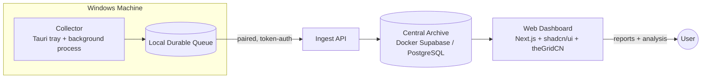

# AI Coding Session Intelligence Platform

A self-hosted application that captures, archives, analyzes, and reports on AI coding tool
usage across projects and machines. It preserves full session history, tracks real and
estimated token/cost usage, correlates AI activity with Git outcomes, surfaces inefficient
context behavior, and generates Markdown reports with recommendations for improving AI
implementation efficiency.

> **V1 focuses on AI Coding Tools.** General AI Chat capture (ChatGPT, Claude, Gemini
> web/desktop) is deferred to V2.

## Why

AI coding tools produce valuable but fragmented operational data. Sessions live in
vendor-specific local stores, CLIs, IDE databases, telemetry streams, or logs — and those
tools can crash, be uninstalled, change formats, or lose history. Usage and cost reporting
is incomplete, making it hard to answer questions like:

- Which projects are consuming the most AI spend?
- Which tools and models are efficient for different types of work?
- How much context is wasted on irrelevant files, lock files, generated output, or logs?
- How often do tool calls fail, and why?
- Which AI sessions produced useful code outcomes?
- Are project-level AI workflows becoming more or less efficient over time?

## Goals

- Preserve maximum-fidelity AI coding tool session history across machines.
- Attribute usage, cost, context behavior, tool calls, failures, and outcomes to projects.
- Support historical trend analysis over time.
- Generate user-selectable Markdown reports with Mermaid diagrams.
- Provide deterministic metrics first, then AI-generated interpretation and recommendations.
- Support a broad connector catalog with stable, experimental, and custom config-only connectors.
- Run as a local-first, self-hosted system backed by a home-server Supabase/PostgreSQL archive.

## Architecture

V1 uses a hybrid local-plus-server architecture.

| Component | Role |
| --- | --- |
| **Collector** | Windows-first background process + Tauri tray control surface. Runs connectors, captures data, buffers to a local durable queue for offline capture. |
| **Ingest API** | Authenticates machines per-token, validates/batches/deduplicates payloads, handles idempotency and version compatibility, orchestrates writes. |
| **Central Archive** | Self-hosted Docker Supabase (PostgreSQL-compatible where practical). Stores raw source records, normalized events, entities, metrics, costs, Git outcomes, reports, and redaction findings. |
| **Web Dashboard** | Self-hosted Next.js app: live monitor, reports, project views, search, connector catalog, machine management, pairing, settings, and export. |

## Technology Choices

- **Desktop app:** Tauri (Windows first; portable to macOS/Linux later)
- **Web dashboard:** Next.js
- **UI system:** shadcn/ui with theGridCN as the visual layer
- **Archive:** local Docker Supabase by default; PostgreSQL-compatible schema where practical
- **Report format:** Markdown with Mermaid support
- **Export formats:** Markdown, JSON, JSONL, CSV, Parquet

## Event Model

The canonical archive is **event-based** — sessions, reports, summaries, and metrics are all
projections over the event log. V1 event taxonomy:

`session.started` · `session.ended` · `message.user` · `message.assistant` ·
`tool.call.started` · `tool.call.completed` · `tool.call.failed` · `file.referenced` ·
`file.read` · `file.modified` · `context.loaded` · `usage.reported` · `usage.estimated` ·
`cost.reported` · `cost.estimated` · `git.commit.detected` · `git.diff.detected` ·
`report.generated` · `connector.health`

Each raw record and normalized event carries its source connector, parser version, catalog
version, event fingerprint, machine, workspace, project attribution (if known), timestamps,
and confidence metadata — enabling deduplication, idempotent ingest, and future replay with
improved parsers and pricing.

## Connectors

V1 ships a broad connector catalog with explicit fidelity labels (capture method, expected
data, known gaps, token/cost confidence, real-time support, tested versions, required
permissions, and stable/experimental/planned status).

**MVP connectors:** Claude Code · OpenAI Codex CLI · Gemini CLI · Antigravity IDE/CLI
(research-gated) · Cursor (research-gated) · generic file/log watcher (custom)

**Catalog (experimental/planned):** opencode · Aider · VS Code GitHub Copilot · GitHub
Copilot CLI · Windsurf · Continue · Cline · Roo Code · Kilo Code · direct API usage
(OpenAI, Anthropic, Google/Gemini, OpenRouter, LiteLLM)

The catalog updates independently from app releases, with a bundled offline baseline, signed
remote updates, local overrides, and user approval for any capture-surface change.

## Reporting & Analysis

Reports are user-selectable and Markdown-first, with Mermaid diagrams, tables, code blocks,
links, metadata, and versioned artifacts that can be compared against prior reports.

**V1 report types:** project cost over time · tool/model comparison · context waste ·
failed tool call · session autopsy · project efficiency · trend anomalies

Analysis runs as a **two-stage pipeline**:

1. **Deterministic metrics** — factual metrics computed from the event log before any AI is involved.
2. **AI interpretation** — a configurable provider receives a compact, redacted report bundle and produces findings, recommendations, Mermaid diagrams, and context-governance suggestions. V1 supports hosted model APIs and OpenAI-compatible providers (local model lifecycle management is deferred).

## Security & Privacy

- Raw, unredacted session data may be stored in the trusted self-hosted Central Archive (maximum archival fidelity).
- Redaction is applied **before** AI analysis or external export; redaction findings are stored as metadata.
- Per-machine ingest tokens are revocable; collectors pair via short-lived dashboard-generated pairing codes.
- Connector permissions are explicit; capture-surface changes require user approval; catalog updates must be signed.
- Encryption-at-rest is supported where practical via database/storage configuration, with app-level sensitive-field encryption planned.

## MVP Success Criteria

V1 is viable when **one Windows machine** can:

- Pair with a self-hosted Supabase/PostgreSQL archive.
- Capture Claude Code, Codex CLI, Gemini CLI, and Antigravity sessions (Cursor if discoverable).
- Run a generic file/log watcher custom connector.
- Store raw source records and normalized events.
- Map sessions to projects and workspaces.
- Compute cost, token, context, failure, and Git outcome metrics.
- Generate Markdown reports with Mermaid diagrams.
- Export report and archive data in Markdown, JSON/JSONL, CSV, and Parquet.

## Onboarding Flow

1. Start local Docker Supabase + dashboard via guided setup.
2. Create admin user.
3. Generate a machine pairing code in the dashboard.
4. Install/start the Windows Tauri collector.
5. Enter dashboard URL + pairing code.
6. Register the machine and issue an ingest token.
7. Discover likely repositories and workspaces.
8. Map repositories/workspaces to projects.
9. Select connectors from the catalog.
10. Review connector permissions and fidelity labels.
11. Test connectors.
12. Start the background collector.
13. Open the Live Monitor and run the first manual report.

## Suggested Implementation Milestones

1. Repository scaffold: monorepo, shared types, DB migrations, dashboard shell, Tauri shell.
2. Archive deployment: Docker Supabase, migrations, ingest API, pairing flow.
3. Collector foundation: durable queue, machine identity, ingest sync, connector framework.
4. First connector: easiest high-fidelity CLI connector, end-to-end.
5. Project/workspace mapping: repo discovery, project creation, mapping UI.
6. Event projections: sessions, usage, cost, connector health, Git metadata.
7. Reporting foundation: deterministic metrics + Markdown report artifacts.
8. AI interpretation: redacted report bundles + configurable analysis provider.
9. Live Monitor: collector health, active sessions, backlog, connector failures.
10. MVP hardening: exports, catalog signing, operational alerts, replay metadata.

## Documentation

- [`PRD.md`](./PRD.md) — full product requirements document.
- [`CONTEXT.md`](./CONTEXT.md) — domain glossary and shared terminology.

## Status

Pre-implementation. This repository currently holds the product requirements and domain
context; scaffolding begins at milestone 1 above.
