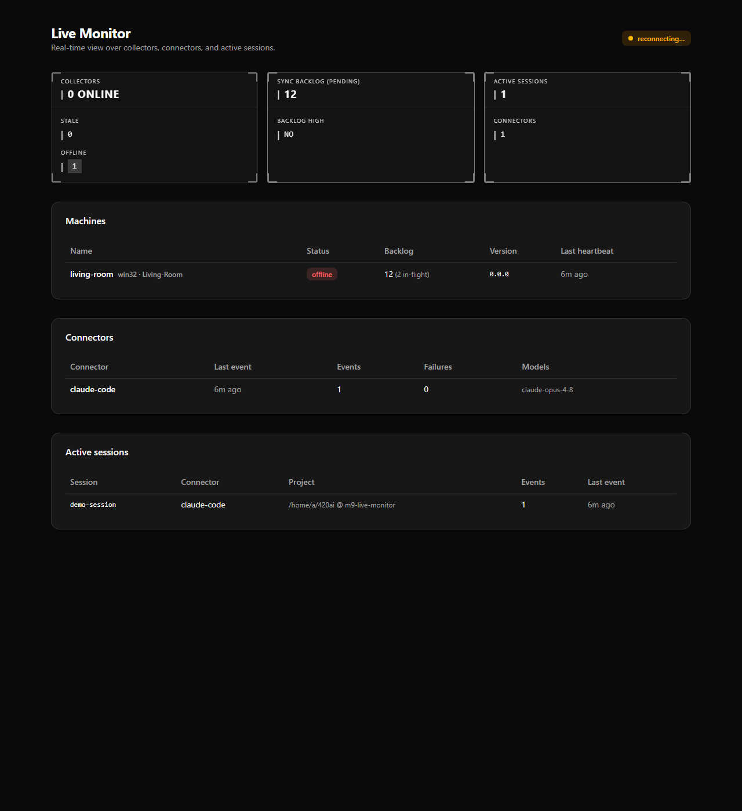

<a id="readme-top"></a>

<!-- Badges derived from the git remote (seanrobertwright/420AI). -->

[![Contributors][contributors-shield]][contributors-url]
[![Forks][forks-shield]][forks-url]
[![Stargazers][stars-shield]][stars-url]
[![Issues][issues-shield]][issues-url]
[![MIT License][license-shield]][license-url]

<!-- TODO: add [![LinkedIn][linkedin-shield]][linkedin-url] once you have a profile URL -->

<br />
<div align="center">
  <a href="https://github.com/seanrobertwright/420AI">
    
  </a>

  <h3 align="center">420AI</h3>
  <p align="center">
    A self-hosted AI Coding Session Intelligence Platform — capture every AI coding-tool session on
    your machine(s), archive it with full fidelity, and turn it into reports on cost, token/context
    efficiency, tool-call failures, and Git outcomes.
    <br />
    <a href="./docs/PRD.md"><strong>Explore the docs »</strong></a>
    <br /><br />
    <a href="https://github.com/seanrobertwright/420AI/issues">Report Bug</a>
    ·
    <a href="https://github.com/seanrobertwright/420AI/issues">Request Feature</a>
  </p>
</div>

<!-- TABLE OF CONTENTS -->
<details>
  <summary>Table of Contents</summary>
  <ol>
    <li><a href="#about-the-project">About The Project</a>
      <ul><li><a href="#built-with">Built With</a></li></ul>
    </li>
    <li><a href="#getting-started">Getting Started</a>
      <ul>
        <li><a href="#prerequisites">Prerequisites</a></li>
        <li><a href="#installation">Installation</a></li>
      </ul>
    </li>
    <li><a href="#usage">Usage</a></li>
    <li><a href="#roadmap">Roadmap</a></li>
    <li><a href="#contributing">Contributing</a></li>
    <li><a href="#license">License</a></li>
    <li><a href="#contact">Contact</a></li>
    <li><a href="#acknowledgments">Acknowledgments</a></li>
  </ol>
</details>

## About The Project

[](.agents/qa/m9/live-monitor.png)

AI coding tools produce valuable but fragmented operational data — sessions live in vendor-specific
local stores, CLIs, and logs that can crash, change format, or lose history. **420AI** captures that
data across machines, archives it with maximum fidelity, and turns it into Markdown reports and a live
dashboard so you can answer questions like _which projects/tools/models are worth the spend_ and _where
context is wasted_.

It is **local-first and self-hosted** (nothing leaves your home server), **event-sourced** (raw records
are the permanent truth; everything else is a re-buildable projection), and **deterministic-metrics-first,
AI-interpretation-second**. The repo is an npm-workspaces monorepo:

- `packages/shared` — token shape, event taxonomy, fingerprint, pricing, cost, ingest wire types
- `packages/db` — Drizzle Postgres schema + migrations, AES-256-GCM field encryption, repositories
- `apps/ingest` — Fastify Ingest API (pairing, bearer-authed idempotent ingest, projections, reports)
- `apps/collector` — headless capture agent (connectors, durable queue, watcher, sync, CLI)
- `apps/dashboard` — Next.js + shadcn/theGridCN Live Monitor
- `apps/desktop` — Tauri (Rust) tray app that supervises the collector as a sidecar

<p align="right">(<a href="#readme-top">back to top</a>)</p>

### Built With

- [TypeScript](https://www.typescriptlang.org/) on [Node.js](https://nodejs.org/) ≥ 24 (ESM, strict)
- [Fastify](https://fastify.dev/) — the Ingest API
- [Drizzle ORM](https://orm.drizzle.team/) + [PostgreSQL 17](https://www.postgresql.org/) (Docker)
- [Next.js](https://nextjs.org/) + [shadcn/ui](https://ui.shadcn.com/) + theGridCN — the dashboard
- [Tauri](https://tauri.app/) (Rust) — the desktop/tray collector
- [Vitest](https://vitest.dev/) — unit + integration tests

<p align="right">(<a href="#readme-top">back to top</a>)</p>

## Getting Started

### Prerequisites

- **Node ≥ 24** (see `.nvmrc`) — the collector queue uses the built-in `node:sqlite`.
- **Docker** — for the PostgreSQL 17 archive (host port 5433).

### Installation

1. Clone the repo
   ```sh
   git clone https://github.com/seanrobertwright/420AI.git
   cd 420AI
   ```
2. Install workspace dependencies
   ```sh
   npm install
   ```
3. Create your env file and fill the two secrets
   ```sh
   cp .env.example .env
   # ARCHIVE_ENCRYPTION_KEY — 32 bytes, base64:
   node -e "console.log(require('crypto').randomBytes(32).toString('base64'))"
   # ADMIN_TOKEN — gates admin endpoints:
   node -e "console.log(require('crypto').randomBytes(32).toString('base64url'))"
   ```
4. Start the archive and apply migrations
   ```sh
   npm run db:up        # postgres:17 on host port 5433
   npm run db:migrate
   ```
5. Run the Ingest API
   ```sh
   npm run ingest:dev   # http://localhost:8420
   ```

<p align="right">(<a href="#readme-top">back to top</a>)</p>

## Usage

**Pair a machine and capture sessions** (collector CLI, run with `tsx` — no build needed):

```sh
# Create a pairing code (admin-gated), then pair the collector
curl -s -X POST localhost:8420/v1/pairing-codes -H "authorization: Bearer $ADMIN_TOKEN" -d '{}'
npx tsx apps/collector/src/cli.ts pair <code> --url http://localhost:8420 --name win-dev

# Run the background capture agent (Ctrl-C drains and stops)
npx tsx apps/collector/src/cli.ts watch

# One-shot ops: drain the queue / inspect backlog / discover repos
npx tsx apps/collector/src/cli.ts sync
npx tsx apps/collector/src/cli.ts queue
npx tsx apps/collector/src/cli.ts discover
```

**Run the dashboard (Live Monitor):**

```sh
npm run dashboard:dev   # reads INGEST_URL + ADMIN_TOKEN from env
```

_For the full setup and day-to-day guide, see [`docs/guide/install.md`](./docs/guide/install.md) and
[`docs/guide/usage.md`](./docs/guide/usage.md)._

<p align="right">(<a href="#readme-top">back to top</a>)</p>

## Roadmap

- [x] M1–M9 — capture → archive → projections → reporting → AI interpretation → Live Monitor
- [x] M10 — hardening: exports, catalog signing, operational alerts, replay metadata
- [x] M11 — Tauri desktop/tray collector
- [x] M12 — Production Readiness / GA (8 slices): basic search, dashboard surfaces, auth hardening,
      ops baseline, archive-replay engine, alert delivery, connector hardening, export/distribution
      polish
- [x] M13 — Capability Gap Closure (7 slices): truth fixes, the 5 remaining report types + context
      governance, archive re-parse, incremental search, alert delivery completion, scheduled reports,
      the Cursor connector
- [ ] **M14 — General AI Chat Capture** (in progress): ChatGPT / Claude / Gemini web+desktop session
      capture (spike-first), plus catalog admin UIs, desktop polish, and per-event search granularity.
      Shipped: **14.5** Claude chat-export connector (batch, non-repo attribution); **14.7** browser
      extension (near-real-time Claude web capture) + collector `push` capture mode — ChatGPT/Gemini
      extension origins deferred

See [`SUMMARY.md`](./SUMMARY.md) and the [open issues](https://github.com/seanrobertwright/420AI/issues)
for the full list.

<p align="right">(<a href="#readme-top">back to top</a>)</p>

## Contributing

This is a single-maintainer project. Contributions, issues, and feature requests are welcome — fork the
repo, create a feature branch, and open a PR. Before committing, ensure the gate passes:

```sh
npm run repo-health           # typecheck + tests + NUL/stray-artifact scans
npm run repo-health -- --require-db   # also runs the Postgres integration layer
```

<p align="right">(<a href="#readme-top">back to top</a>)</p>

## License

Distributed under the **MIT License**. See `LICENSE` for more information.

<p align="right">(<a href="#readme-top">back to top</a>)</p>

## Contact

<!-- TODO: confirm public contact details -->

Sean Wright — <!-- TODO: email / social handle -->

Project Link: [https://github.com/seanrobertwright/420AI](https://github.com/seanrobertwright/420AI)

<p align="right">(<a href="#readme-top">back to top</a>)</p>

## Acknowledgments

- [othneildrew/Best-README-Template](https://github.com/othneildrew/Best-README-Template) — README structure
- [Shields.io](https://shields.io) — badges

<p align="right">(<a href="#readme-top">back to top</a>)</p>

<!-- MARKDOWN LINKS & IMAGES -->

[contributors-shield]: https://img.shields.io/github/contributors/seanrobertwright/420AI.svg?style=for-the-badge
[contributors-url]: https://github.com/seanrobertwright/420AI/graphs/contributors
[forks-shield]: https://img.shields.io/github/forks/seanrobertwright/420AI.svg?style=for-the-badge
[forks-url]: https://github.com/seanrobertwright/420AI/network/members
[stars-shield]: https://img.shields.io/github/stars/seanrobertwright/420AI.svg?style=for-the-badge
[stars-url]: https://github.com/seanrobertwright/420AI/stargazers
[issues-shield]: https://img.shields.io/github/issues/seanrobertwright/420AI.svg?style=for-the-badge
[issues-url]: https://github.com/seanrobertwright/420AI/issues
[license-shield]: https://img.shields.io/github/license/seanrobertwright/420AI.svg?style=for-the-badge
[license-url]: https://github.com/seanrobertwright/420AI/blob/main/LICENSE
