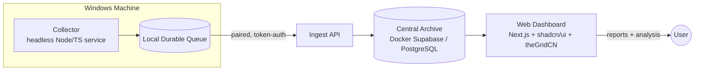

# AI Coding Session Intelligence Platform

A self-hosted application that captures, archives, analyzes, and reports on AI coding tool
usage across projects and machines. It preserves full session history, tracks real and
estimated token/cost usage, correlates AI activity with Git outcomes, surfaces inefficient
context behavior, and generates Markdown reports with recommendations for improving AI
implementation efficiency.

> **V1 focuses on AI Coding Tools.** General AI Chat capture (ChatGPT, Claude, Gemini
> web/desktop) is deferred to V2.

## Why

AI coding tools produce valuable but fragmented operational data. Sessions live in
vendor-specific local stores, CLIs, IDE databases, telemetry streams, or logs — and those
tools can crash, be uninstalled, change formats, or lose history. Usage and cost reporting
is incomplete, making it hard to answer questions like:

- Which projects are consuming the most AI spend?
- Which tools and models are efficient for different types of work?
- How much context is wasted on irrelevant files, lock files, generated output, or logs?
- How often do tool calls fail, and why?
- Which AI sessions produced useful code outcomes?
- Are project-level AI workflows becoming more or less efficient over time?

## Goals

- Preserve maximum-fidelity AI coding tool session history across machines.
- Attribute usage, cost, context behavior, tool calls, failures, and outcomes to projects.
- Support historical trend analysis over time.
- Generate user-selectable Markdown reports with Mermaid diagrams.
- Provide deterministic metrics first, then AI-generated interpretation and recommendations.
- Support a broad connector catalog with stable, experimental, and custom config-only connectors.
- Run as a local-first, self-hosted system backed by a home-server Supabase/PostgreSQL archive.

## Architecture

V1 uses a hybrid local-plus-server architecture.



| Component | Role |
| --- | --- |
| **Collector** | Windows-first headless Node/TS background service (Tauri tray control surface deferred to a later iteration). Runs connectors, captures data via file-watch, buffers to a local durable queue for offline capture. |
| **Ingest API** | Authenticates machines per-token, validates/batches/deduplicates payloads, handles idempotency and version compatibility, orchestrates writes. |
| **Central Archive** | Self-hosted Docker Supabase (PostgreSQL-compatible where practical). Stores raw source records, normalized events, entities, metrics, costs, Git outcomes, reports, and redaction findings. |
| **Web Dashboard** | Self-hosted Next.js app: live monitor, reports, project views, search, connector catalog, machine management, pairing, settings, and export. |

## Technology Choices

- **Collector (V1):** headless Node/TypeScript service (single language with the dashboard; Windows first, portable later)
- **Desktop app:** Tauri — deferred to a later iteration as the collector's tray/control surface
- **Web dashboard:** Next.js
- **UI system:** shadcn/ui with theGridCN as the visual layer (fallback: plain shadcn/ui)
- **Archive:** local Docker Supabase by default; PostgreSQL-compatible schema where practical
- **Report format:** Markdown with Mermaid support
- **Export formats (V1):** Markdown, JSON, JSONL, CSV (Parquet deferred past V1)

## Event Model

The canonical archive is **event-based** — sessions, reports, summaries, and metrics are all
projections over the event log. V1 event taxonomy:

`session.started` · `session.ended` · `message.user` · `message.assistant` ·
`tool.call.started` · `tool.call.completed` · `tool.call.failed` · `file.referenced` ·
`file.read` · `file.modified` · `context.loaded` · `usage.reported` · `usage.estimated` ·
`cost.reported` · `cost.estimated` · `git.commit.detected` · `git.diff.detected` ·
`report.generated` · `connector.health`

Each raw record and normalized event carries its source connector, parser version, catalog
version, event fingerprint, machine, workspace, project attribution (if known), timestamps,
and confidence metadata — enabling deduplication, idempotent ingest, and future replay with
improved parsers and pricing.

## Connectors

V1 ships a broad connector catalog with explicit fidelity labels (capture method, expected
data, known gaps, token/cost confidence, real-time support, tested versions, required
permissions, and stable/experimental/planned status).

**Required (MVP):** Claude Code · OpenAI Codex CLI · Gemini CLI · generic file/log watcher
(custom) — the three tools all verified high-fidelity (exact tokens + model + tool calls).

**Stretch / research-gated:** Antigravity IDE/CLI (rich tool actions but no token/cost data) ·
Cursor (its conversation store is not in `~/.cursor`; needs follow-up research)

**Catalog (experimental/planned):** opencode · Aider · VS Code GitHub Copilot · GitHub
Copilot CLI · Windsurf · Continue · Cline · Roo Code · Kilo Code · direct API usage
(OpenAI, Anthropic, Google/Gemini, OpenRouter, LiteLLM)

The catalog updates independently from app releases, with a bundled offline baseline, signed
remote updates, local overrides, and user approval for any capture-surface change.

## Reporting & Analysis

Reports are user-selectable and Markdown-first, with Mermaid diagrams, tables, code blocks,
links, metadata, and versioned artifacts that can be compared against prior reports.

**V1 report types:** project cost over time · tool/model comparison · context waste ·
failed tool call · session autopsy · project efficiency · trend anomalies

Analysis runs as a **two-stage pipeline**:

1. **Deterministic metrics** — factual metrics computed from the event log before any AI is involved.
2. **AI interpretation** — a configurable provider receives a compact, redacted report bundle and produces findings, recommendations, Mermaid diagrams, and context-governance suggestions. V1 supports hosted model APIs and OpenAI-compatible providers (local model lifecycle management is deferred).

## Security & Privacy

- Session data is stored in the trusted self-hosted Central Archive with **field-level encryption of sensitive payloads from day one** (message bodies, tool-call args/outputs, file/command content); token counts and costs stay plaintext and queryable.
- Redaction is applied **before** AI analysis or external export; redaction findings are stored as metadata. Full-text search runs over a redacted plaintext projection, not the encrypted originals.
- Per-machine ingest tokens are revocable; collectors pair via short-lived dashboard-generated pairing codes.
- Connector permissions are explicit; capture-surface changes require user approval; catalog updates must be signed.
- Database/storage encryption-at-rest is additionally enabled where practical; the encryption key lives outside the database.

## MVP Success Criteria

V1 is viable when **one Windows machine** can:

- Pair with a self-hosted Supabase/PostgreSQL archive.
- Capture Claude Code, Codex CLI, and Gemini CLI sessions (Antigravity and Cursor are stretch/research-gated).
- Run a generic file/log watcher custom connector.
- Store raw source records and normalized events.
- Map sessions to projects and workspaces.
- Compute cost, token, context, failure, and Git **metadata** metrics (outcome attribution is manual-plus-heuristic in V1).
- Generate Markdown reports with Mermaid diagrams.
- Export report and archive data in Markdown, JSON, JSONL, and CSV.

## Onboarding Flow

1. Start local Docker Supabase + dashboard via guided setup.
2. Create admin user.
3. Generate a machine pairing code in the dashboard.
4. Install/start the Windows collector (headless Node/TS service in V1; Tauri tray later).
5. Enter dashboard URL + pairing code.
6. Register the machine and issue an ingest token.
7. Discover likely repositories and workspaces.
8. Map repositories/workspaces to projects.
9. Select connectors from the catalog.
10. Review connector permissions and fidelity labels.
11. Test connectors.
12. Start the background collector.
13. Open the Live Monitor and run the first manual report.

## Suggested Implementation Milestones

1. Repository scaffold: monorepo, shared types, DB migrations, dashboard shell, headless collector shell (no Tauri in V1).
2. Archive deployment: Docker Supabase, migrations, ingest API, pairing flow.
3. Collector foundation: durable queue, machine identity, ingest sync, connector framework.
4. First connector: Claude Code end-to-end, then Codex CLI, then Gemini CLI.
5. Project/workspace mapping: repo discovery, project creation, mapping UI.
6. Event projections: sessions, usage, cost, connector health, Git metadata.
7. Reporting foundation: deterministic metrics + Markdown report artifacts.
8. AI interpretation: redacted report bundles + configurable analysis provider.
9. Live Monitor: collector health, active sessions, backlog, connector failures.
10. MVP hardening: exports, catalog signing, operational alerts, replay metadata.

## Documentation

- [`PRD.md`](./docs/PRD.md) — full product requirements document.
- [`CONTEXT.md`](./docs/CONTEXT.md) — domain glossary and shared terminology.

## Development (Milestone 1)

Milestone 1 is the **walking skeleton**: read one Claude Code session JSONL file, normalize it into
raw records + events, store both in SQLite, compute cost from tokens × catalog pricing, and render a
Markdown session report.

### Prerequisites

- **Node ≥ 24** (the store uses the built-in `node:sqlite` — no Docker, no native build). See `.nvmrc`.

### Setup & checks

```bash
npm install        # wires the npm workspaces (packages/shared, apps/collector)
npm run typecheck  # tsc -b across both workspaces, strict mode, zero errors
npm test           # vitest: unit + integration suites
```

### CLI

The collector exposes two commands. Run them with `tsx` (no build needed):

```bash
# Ingest one Claude Code session file into the local SQLite store
npx tsx apps/collector/src/cli.ts ingest \
  "$HOME/.claude/projects/<cwd-slug>/<session-uuid>.jsonl" --db ./420ai.sqlite

# Render a Markdown report for a stored session
npx tsx apps/collector/src/cli.ts report <session-uuid> --db ./420ai.sqlite
```

Re-ingesting the same file is **idempotent** (events upsert by deterministic fingerprint), so it is
safe to run repeatedly.

### Notes

- The SQLite DB file (`*.sqlite`/`*.db`) is **gitignored** — it is local state, never committed.
- `node:sqlite` is experimental in Node 24 and prints an `ExperimentalWarning` on import **by design**;
  it does not affect correctness and tests pass with it present.

## Development (Milestone 2)

Milestone 2 graduates the local SQLite mirror into the **real Central Archive**: a self-hosted
PostgreSQL database (Docker), a typed Drizzle schema with versioned migrations, a dedicated
**Ingest API** (Fastify) that authenticates machines per-token and writes batches idempotently,
**field-level AES-256-GCM encryption** of sensitive payloads at the ingest boundary, and the
**collector pairing flow**. A thin `collector push` sends a parsed session to the API.

Sensitive content (raw JSONL lines, event tool payloads) is **encrypted at rest**; token counts and
costs stay **plaintext and queryable** (PRD §18.1). The encryption key lives only in `.env`, never in
the database. Per-machine ingest tokens are revocable.

### Prerequisites

- **Node ≥ 24** and **Docker** (Postgres 17).

### Setup

```bash
cp .env.example .env          # then fill the two secrets below
# ARCHIVE_ENCRYPTION_KEY — 32 bytes, base64:
node -e "console.log(require('crypto').randomBytes(32).toString('base64'))"
# ADMIN_TOKEN — gates POST /v1/pairing-codes:
node -e "console.log(require('crypto').randomBytes(32).toString('base64url'))"

npm install        # wires packages/db + apps/ingest into the workspace
npm run db:up      # start postgres:17 (host port 5433; container 5432)
npm run db:migrate # apply Drizzle migrations (6 tables + __drizzle_migrations)
npm run ingest:dev # start the Ingest API on http://localhost:8420
```

> The archive listens on host port **5433** (a Postgres on 5432 is common on dev machines).
> `DATABASE_URL`/`DATABASE_URL_TEST` in `.env.example` already point at 5433.

### Onboarding flow (headless M2 — the dashboard supersedes the admin endpoint later)

```bash
# 1. Health check
curl -s localhost:8420/v1/health
# 2. Create a pairing code (admin-gated)
curl -s -X POST localhost:8420/v1/pairing-codes \
  -H "authorization: Bearer $ADMIN_TOKEN" -H "content-type: application/json" -d '{}'
# 3. Pair the collector (persists ~/.420ai/credentials.json)
npx tsx apps/collector/src/cli.ts pair <code> --url http://localhost:8420 --name win-dev
# 4. Push a real Claude Code session (token read from saved credentials if omitted)
npx tsx apps/collector/src/cli.ts push \
  "$HOME/.claude/projects/<cwd-slug>/<session-uuid>.jsonl" --url http://localhost:8420 --token <token>
```

Re-running `push` is **idempotent** — raw records dedup by `(machine, connector, source_record_id)`
and events upsert by the machine-independent fingerprint (PRD §23), so a re-push reports
`recordsInserted: 0`.

### Testing

```bash
npm test                       # unit suites run with NO database; *.int.test.ts self-skip
npm run db:up && npm run db:migrate && npm test   # full suite incl. Postgres integration
```

Integration tests require `docker compose up` and a filled `.env` (`DATABASE_URL_TEST`,
`ARCHIVE_ENCRYPTION_KEY`); without them they self-skip so `npm test` always passes locally.

### Verify encryption-at-rest in psql

```bash
docker compose exec archive psql -U 420ai -d 420ai \
  -c "SELECT left(payload_ciphertext,40), payload_iv FROM raw_source_records LIMIT 1;"   # base64, not JSON
docker compose exec archive psql -U 420ai -d 420ai \
  -c "SELECT event_type, tokens->>'total', cost->>'usd' FROM events WHERE tokens IS NOT NULL LIMIT 3;"   # readable
```

## Development (Milestone 3)

Milestone 3 turns the collector from a manual one-shot `push` into a **continuously-running
background capture agent**. It discovers and tails each Claude Code session file, captures new
activity as it is written, buffers it to a **durable on-disk queue** (offline-safe, crash-safe),
and **syncs** it to the M2 Ingest API whenever the archive is reachable — resuming exactly where it
left off after a restart and never losing or duplicating data. It adds **no server code and no new
Postgres tables**: it feeds the existing M2 Ingest API through the existing ingest client.

Five new internal pieces (all in `apps/collector`): a typed **machine identity** module over
`~/.420ai/credentials.json`; a **durable queue + per-file cursor store** (`~/.420ai/queue.sqlite`,
`node:sqlite`) with content-hash dedup and a claim/ack/retry-backoff state machine; a pure
**byte-offset tailer** that reads only complete lines (a partial trailing line is never captured) and
detects truncation; a typed **connector framework** (`id` + PRD §10.3 fidelity fields + `watchGlobs`
+ `parse`) with Claude Code as the one stable connector; a **poll-based file watcher**; and a
**retrying sync worker** (capped exponential backoff on network/5xx, stop-and-surface on 401).

The M3 connector was **Claude Code only**. **M4 fills out the connector layer to three at full
fidelity** (see below) — still no server code and no new Postgres tables.

### Milestone 4 — connectors to full fidelity

M4 takes the capture layer from one partial connector to **three full-fidelity** ones:

- **Claude Code (thickened):** the tool-call lifecycle is now correlated
  (`tool.call.completed`/`tool.call.failed` by `tool_use_id`), plus `file.read`/`file.modified`
  (from `Read`/`Edit`/`Write`/…) and `context.loaded` (from attachment records). `PARSER_VERSION`
  bumped to `2.0.0`; re-derived events upsert in place.
- **OpenAI Codex CLI (new):** tails the append-only rollout JSONL
  (`~/.codex/sessions/…/rollout-*.jsonl`), emits per-turn token usage from the `last_token_usage`
  **delta** (never the cumulative snapshot), carries the model forward from `turn_context`.
- **Gemini CLI (new):** a single JSON file **rewritten** per turn, captured by a new additive
  `captureMode: "snapshot"` (whole-file re-read on size/mtime change) that coexists with the proven
  byte-offset `tail` path. Thought tokens fold into `output` so the normalized `total` reproduces the
  vendor total.

All three normalize onto the frozen token shape (`computeTotal`/`computeCost` unchanged); whole-file
re-parse stays idempotent via the queue's content-hash dedup and the server's fingerprint upsert.

### Prerequisites

- **Node ≥ 24** and (for sync) a paired archive — complete the M2 onboarding flow first.

### New CLI commands

```bash
# Run the background capture agent (Ctrl-C stops it with a graceful final drain)
npx tsx apps/collector/src/cli.ts watch [--interval <ms>] [--url <baseUrl>] [--token <token>]

# One-shot: drain the durable queue to the archive (testable / ops)
npx tsx apps/collector/src/cli.ts sync [--url <baseUrl>] [--token <token>]

# Print the queue backlog/stats
npx tsx apps/collector/src/cli.ts queue
```

`watch` resolves credentials from the saved pairing (`~/.420ai/credentials.json`) unless overridden;
if the machine is unpaired it prints "run `collector pair`…" and exits. The M1 `ingest`/`report` and
M2 `pair`/`push` commands are unchanged.

### Local state (`~/.420ai/`)

`~/.420ai/` is the collector home and holds `credentials.json` (the M2 pairing) plus `queue.sqlite`
(the durable queue + per-file byte-offset cursors). It is **local state**, lives outside the repo, and
is never committed (`*.sqlite` is gitignored; the directory is outside the tree entirely).

### Behavior guarantees

- **Restart-resume:** per-file byte-offset cursors mean a restart re-sends nothing already captured;
  only newly appended, newline-terminated lines flow.
- **Offline capture:** if the archive is unreachable the queue buffers and retries with backoff;
  nothing is lost. A revoked token (401) stops the sync loop with a clear "re-pair needed" — no spin.
- **Idempotent:** local dedup (raw by `connector:sourceRecordId`, events by fingerprint) mirrors the
  server's idempotency, so a re-send is a no-op at both layers (PRD §23).

### Testing

```bash
npm test                       # unit suites run with NO database; *.int.test.ts self-skip
npm run db:up && npm run db:migrate && npm test   # full suite incl. the Postgres integration test
```

`capture-engine.int.test.ts` drives the watcher → queue → in-process M2 ingest app → Postgres path
and self-skips without `DATABASE_URL_TEST` (Docker + a filled `.env`).

### Milestone 5 — project / workspace mapping

M5 gives the flat event stream **structure and attribution** — headless (no dashboard; the mapping UI
is deferred to a dedicated dashboard milestone that consumes this exact API):

- **Data model:** three new archive tables (`projects`, `workspaces`, `workspace_keys`) via a single
  generated Drizzle migration. The `events` table is **unchanged** — attribution is a JOIN
  (`events.project_path` → `workspace_keys.project_key` → `workspaces.project_id`), never a column.
- **Repo discovery (collector):** each connector enumerates the distinct project roots in its own
  store; a shared, pure git-metadata reader parses `.git/config` + `.git/HEAD` (no `git` subprocess),
  and Gemini's opaque `projectHash` is reverse-mapped to a real path via its `.project_root` sidecar
  (legacy hash-only sessions are reported as an unattributed gap, not an error).
- **Project creation + mapping:** `POST /v1/workspaces/discover` (machine-authed) upserts workspaces
  and **auto-creates one project per workspace**, unifying across machines by git remote. Admin
  endpoints list/create/rename projects and remap a workspace — the auto-mapping is an editable
  default, and re-discovery preserves a manual remap.
- **Attribution resolver:** `resolveWorkspaceId` + a per-project `/summary` join prove the wiring
  end-to-end (the building block M6 materializes at scale).

```bash
# Enumerate roots from all three connectors, enrich with git + Gemini reverse-map, POST them
npx tsx apps/collector/src/cli.ts discover [--url <baseUrl>] [--token <token>]

# List the archive's projects (admin-authed — pass --token <adminToken>)
npx tsx apps/collector/src/cli.ts projects [--url <baseUrl>] [--token <adminToken>]
```

`discover` is a one-shot ops command (the `watch` daemon is unchanged) and is idempotent: re-running
upserts workspaces with no duplicate projects or keys. No change to the M1 fingerprint, the M2 event
wire types/encryption split, or any connector's `parse`.

## Status

Milestones 1–6 implemented. M1 (walking skeleton): `packages/shared` (token shape, event taxonomy,
fingerprint, pricing catalog, cost ladder) and `apps/collector` (Claude Code parser, SQLite store,
Markdown report, CLI). M2 (archive deployment): `packages/db` (Drizzle Postgres schema + migrations,
AES-256-GCM field encryption, ingest token + pairing repositories), `apps/ingest` (Fastify Ingest API
— pairing, bearer-authed idempotent ingest, health), and `apps/collector` `pair`/`push` commands.
M3 (collector foundation): `apps/collector` machine identity, durable queue + per-file cursors,
connector framework, poll-based file watcher, retrying sync worker, and the `watch`/`sync`/`queue`
commands — a continuous, offline-safe, restart-resuming Claude Code capture agent. M4 (connectors to
full fidelity): Claude Code thickened to the full tool/file/context taxonomy, plus the **Codex CLI**
(append-only tail) and **Gemini CLI** (whole-file `snapshot` capture mode) connectors — all at exact
token/computed-cost fidelity, with no server or schema change. M5 (project / workspace mapping):
`packages/db` (`projects`/`workspaces`/`workspace_keys` tables + migration, find-or-create-by-remote
and the `resolveWorkspaceId`/`projectEventSummary` attribution join), `apps/ingest` (machine-authed
`/v1/workspaces/discover` + admin project/workspace CRUD + `/summary`), and `apps/collector` (pure
git-metadata + Gemini `.project_root` readers, per-connector `discoverRoots`, the discover engine, and
the `discover`/`projects` commands) — headless; the mapping UI is deferred. M6 (event projections):
the **Deterministic Metrics Pipeline** (PRD §16.1) — `packages/shared` (projection result shapes +
the promoted `lowestConfidence` ladder), `packages/db` (a read-only `projections` repository
extending the M5 attribution join: per-project/-model/-time usage, cost with lowest-confidence-wins,
session shape, derived connector health, and git metadata), and `apps/ingest` (admin-gated GET
endpoints over those projections). On-demand SQL over the event log — no migration, no capture
change, never decrypts a payload; Markdown report artifacts are deferred to M7. Milestones 7–10 above
thicken this
skeleton.
