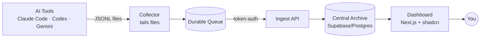
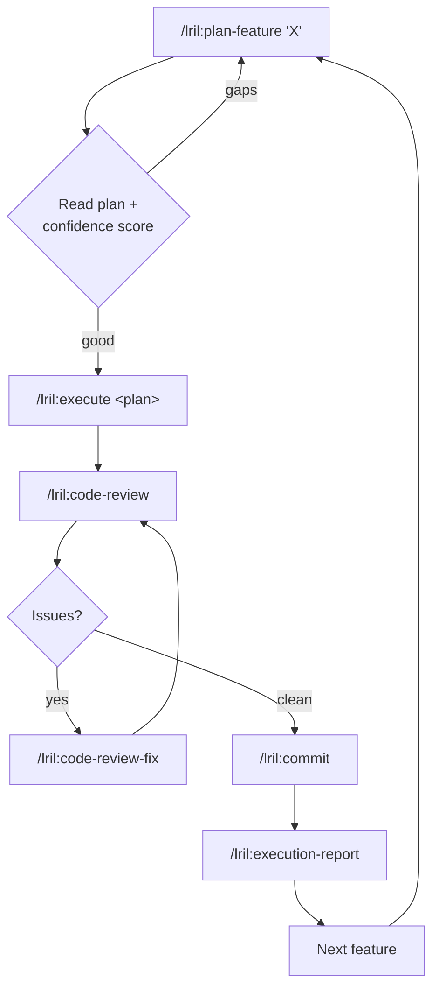

# 420AI — Working Summary & Execution Flow

> A one-page mental model. The full spec is [`docs/PRD.md`](./docs/PRD.md); the domain
> glossary is [`docs/CONTEXT.md`](./docs/CONTEXT.md). This file captures **what we're building,
> how we'll build it, and the decisions made so far.**

---

## 0. Status — 2026-06-20

**V1 is ~95% built.** Milestones **1–9 are implemented and on `main`** (M9 Live Monitor merged via
PR #12). **M10 (hardening)** is a *bundle* built in slices: the **operational-alerts slice** (the
stateless `deriveAlerts` projection on the M9 snapshot), **3a exports (§22)**, **3b replay metadata
(§23)**, **3c the persisted alert engine**, and **3d catalog signing (§10.4/§18)** are **all done — the
M10 bundle is complete.** 3c added two additive tables (`machine_heartbeats` time-series + `alert_firings`
firing history/ack via a partial unique index; migration `0006`), the `sync.backlog_growing` derivative
layered beside the frozen `deriveAlerts`, an **evaluate-on-read** reconcile inside `buildSnapshot` (no
background dispatcher), and a `/monitor` Ack button; the snapshot stamp bumped `m10-monitor-v1` →
`m10-monitor-v2`. **3d** shipped an ed25519 verify primitive (`@420ai/shared/catalog-signing.ts`, no new
dependency) + a bundled public key + an offline `scripts/sign-catalog.ts` signer (private key offline-only),
the `pricing_catalogs` table (migration `0007`) with a `pending → active` approval gate (partial-unique
≤1 active), four admin endpoints (`POST/GET /v1/catalog`, `:id/approve`, `:id/reject`), **ingest-time
re-pricing under the active catalog** (going forward only; historical replay still deferred), and the
`catalog.update_requires_approval` §20 alert via the existing 3c firing surface. Deferred: the
archive-replay engine (retroactive re-pricing) and making connectors catalog-driven (this bundle is
pricing-only). **M11 (Tauri desktop/tray collector)** — the first *post-V1* milestone — is **built across
Slices 1–5**: a Tauri (Rust + system-webview) shell that bundles and lifecycle-supervises the headless
collector as a `node:sea` **sidecar** (Rust stays off the capture path), with a tray; a Sync & Health
panel + connector management; GUI pairing + run-on-login autostart + secrets in the Windows Credential
Manager; a Settings panel that supervises the full local server-stack (Docker archive + ingest); and a
local **NSIS** installer. See the slice plans under
[`.agents/plans/`](./.agents/plans/) (`m11-tauri-desktop.md` for the bundle + Slices 1–2, then
`m11-slice{2,3,4,5}-*.md`).

**M12 (Production Readiness / GA)** is the **active milestone** (planned 2026-06-20 from a deferral
audit). It closes every deferred V1/M11 item — Basic Search + dashboard surfaces (the two V1 functional
holes), real admin auth, an ops baseline, the archive-replay engine, alert delivery, connector
hardening, and export/distribution polish — taking the product to **shippable, self-hosted, single-user
GA**. Multi-user/RBAC/SaaS is V2. Sliced 12.1–12.8 in dependency order; see §3, §6, and PRD §25 M12.

**CI gate:** a `repo-health` GitHub Actions check (repo-root `tsc -b` + NUL/stray scans + the full
vitest suite **including the Postgres integration layer**) runs on every PR to `main`
(`.github/workflows/repo-health.yml`).
⚠️ It is **not yet a hard *blocking* required check** — branch protection on a **private** repo needs
**GitHub Pro**. Until that's resolved: **never merge a PR whose `repo-health` check is red.** (One red
merge already slipped through — M8 / PR #7 merged with a typecheck error — and needed hotfix PR #8.)

---

## 1. What we're building (one breath)

A **self-hosted AI Coding Session Intelligence Platform**: it captures every AI coding-tool
session on your machine(s), archives them with full fidelity, and turns them into Markdown
reports about **cost, token/context efficiency, tool-call failures, and Git outcomes** — so you
can see which projects/tools/models are worth the spend and where context is wasted.

- **Local-first, self-hosted.** Nothing leaves your home server.
- **Event-sourced.** Raw records are the permanent truth; everything else is a re-buildable projection.
- **Deterministic metrics first, AI interpretation second.**

---

## 2. The build LOOP (per feature)

These skills run **once per feature**, not once for the whole project. Walk down the PRD
milestones (§25), running this loop for each:

| Step | Skill | Produces | Code? |
|---|---|---|---|
| 1. Plan | `/lril:plan-feature "<feature>"` | `.agents/plans/<name>.md` + confidence score | No |
| 2. Build | `/lril:execute <plan-path>` | code + tests, runs validations | **Yes** |
| 3. Review | `/lril:code-review` | `.agents/code-reviews/<name>.md` (pre-commit gate) | No |
| 4. Fix | `/lril:code-review-fix` (if needed) | fixes; re-review until clean | Yes |
| 5. Commit | `/lril:commit` | the commit | — |
| 6. Reflect | `/lril:execution-report` | `.agents/execution-reports/<name>.md` (improves next loop) | No |

**Rules of thumb**
- Always **read & correct the plan** before executing — cheapest place to catch a wrong approach.
- `/lril:prime` at the **start of each session** to reload context.
- `/lril:system-review` periodically; `/lril:rca` when something breaks.
- Bootstrap: first feature establishes the conventions every later feature mirrors.

---

## 3. Build ORDER (PRD §25 milestones)

**V1 (M1–M10):**
1. ✅ Walking skeleton: **one connector (Claude Code) → ingest → store → one report.**
2. ✅ Archive deployment: Docker Postgres, migrations, ingest API, pairing flow, field encryption.
3. ✅ Collector foundation: durable queue, machine identity, ingest sync, connector framework, per-file cursors.
4. ✅ Connectors to full fidelity: Claude Code lifecycle/file/context, then Codex + Gemini.
5. ✅ Project/workspace mapping (repo discovery + attribution resolver).
6. ✅ Event projections: sessions, usage, cost, connector health, Git metadata.
7. ✅ Reporting: deterministic metrics + durable, versioned Markdown report artifacts.
8. ✅ AI interpretation: redaction engine + decrypt-for-render + configurable provider (Anthropic + OpenAI-compatible).
9. ✅ Live Monitor: collector heartbeat → real-time monitor API + SSE → first Next.js dashboard (shadcn/theGridCN).
10. ✅ Hardening: exports, catalog signing, alerts, replay metadata (M10 bundle 3a/3b/3c/3d all done).

**Post-V1:**
11. ✅ **Tauri desktop/tray collector** (Slices 1–5) — Tauri (Rust + system-webview) shell over the
    headless collector (`node:sea` sidecar, Rust off the capture path); tray + connector mgmt +
    sync/health + GUI pairing + run-on-login autostart + Windows Credential Manager secrets + Settings
    that supervises the local server-stack (Docker archive + ingest via Rust `std::process::Command`);
    local **NSIS** installer (`npm run build:desktop`). MSI/signed installer + auto-update deferred (§25).
12. ⏳ **Production Readiness / GA** — **PLANNED** (origin: 2026-06-20 deferral audit). One milestone in
    thin slices that takes the product from feature-built to **shippable, self-hosted, single-user GA**.
    Target = self-hosted single-user; **multi-user/RBAC/SaaS → V2**. Slices (dependency order):
    **12.1** Basic Search (§21) · **12.2** Dashboard surfaces (§8.4) · **12.3** Auth hardening (real admin
    login, retire static `ADMIN_TOKEN`/`DEFAULT_EMAIL`) · **12.4** Ops baseline (CI blocking gate, backups
    + retention, server observability, rate limiting, key rotation, migration rollback) · **12.5**
    Archive-replay engine (§23, retroactive re-derive/re-price) · **12.6** Alert delivery + remaining §20
    conditions · **12.7** Connector hardening (Codex failure classification, per-connector permission
    scopes, connector-catalog-as-data, Cursor/Antigravity) · **12.8** Export/distribution polish (Parquet,
    restore UI, signed installer/auto-update/MSI). See PRD §25 M12.

> **Principle:** nothing shows value until the pipe is whole — so make the *thinnest* end-to-end
> pipe first (milestone 1), then thicken each stage.

---

## 4. DECISIONS LOG (from PRD review)

### Connector capture (Q1) — confirmed feasible on this machine
| Tool | Location | Format | Liveness |
|---|---|---|---|
| **Claude Code** (required) | `~/.claude/projects/<slug>/<uuid>.jsonl` | JSONL, append | Streaming (tail) |
| **Codex CLI** (required) | `~/.codex/sessions/YYYY/MM/...` + `history.jsonl` | JSONL | Streaming |
| **Gemini CLI** (required) | `~/.gemini/tmp/<projectHash>/chats/session-*.json` | JSON | Near-real-time |
| **Antigravity** (stretch) | `~/.gemini/antigravity-*` | JSONL + protobuf | Partial — gated (no token/cost) |
| **Cursor** (stretch) | `~/.cursor/...` (chat store actually in `%APPDATA%\Cursor`) | SQLite | Snapshot/poll |

**Done:** spike completed → [`docs/research/connector-capture-spike.md`](./docs/research/connector-capture-spike.md).
All three required connectors record **exact tokens + model + tool calls**; none report cost (computed from
tokens × catalog pricing).

### Liveness (Q2) — "as live as the format allows, labeled honestly"
- Watch files, read only **newly appended lines**, push to queue, flush every few seconds.
- Track a per-file **byte-offset cursor** so restarts resume instead of re-sending.
- Liveness is a **per-connector fidelity label**: Streaming (JSONL) / Snapshot (SQLite) / Batch (protobuf).
- Live Monitor shows **"last event N sec ago"** — never fake real-time.

### MVP success criteria (Q3) — contradiction removed
- **Required:** Claude Code + Codex CLI + Gemini CLI (all confirmed JSONL).
- **Stretch / research-gated:** Antigravity + Cursor — ship when verified, never block MVP.

### Git outcome attribution (Q4) — split into two layers
1. **Git metadata** (build now, 100% factual): hash, author, time, branch, changed files, line counts.
2. **Linking** (keep simple): manual link + one heuristic suggestion
   *(same repo + commit within X min of session end + ≥1 file overlap → low/med-confidence suggestion to confirm)*.
   Defer the full weighted scorer. Always show confidence; auto-links are suggestions, not facts.

### Replay reconciliation (Q5) — upsert-by-fingerprint
- **Principle:** raw records are sacred & permanent; normalized events are disposable/re-buildable.
- **Fingerprint** = `hash(source_connector + raw_record_id + event_index + event_type)` — deterministic.
- Re-parse → upsert by fingerprint, stamp `parser_version`. (Same primitive also powers Q4's "already attributed?".)
- Simple now; the stored `parser_version` keeps the door open to versioned generations later.

### Pricing & cost (Q6) — catalog table + fallback ladder
- Pricing lives in the **catalog**: `model → {input/output $/token, source, as-of date}`.
- Ladder: **tool/provider-reported** → else **estimate (model known)** → else **estimate (model unknown)**, each labeled with confidence.
- Updates: **manual trigger first** ("Check for pricing updates"); optional schedule later.

### Security (Q7) — field-level encryption from day one
- **Encrypt:** message bodies, tool-call args/outputs, file contents, command output, detected secrets.
- **Plaintext (queryable):** timestamps, model, project/workspace IDs, token counts, costs, event type, fingerprint.
- Key held by the app/server, **not** in the DB; decrypt only to render or to feed redaction.
- **Tension:** can't full-text-search encrypted data (PRD §21).
  **Resolution:** search a **redacted plaintext projection** (secrets masked); keep originals encrypted.

### Smaller decisions — all accepted
- ✅ **Defer Tauri** — Node/TS collector first (single language); the tray/desktop app is now **M11** (post-V1), sidecar architecture, theGridCN UI.
- ✅ **theGridCN** with plain shadcn/ui as fallback (dashboard **and** the M11 desktop app).
- ✅ **Defer Parquet** — V1 exports = Markdown / JSON / JSONL / CSV.
- ✅ Add rough **volume/retention** numbers to the PRD.
- ✅ Name a simple **regex/entropy redaction engine** for V1 (shipped in M8).

### M11 (Tauri desktop) — resolutions that overrode the bundle plan
These were decided during Slices 1–5 implementation and supersede the open design points the PRD §25
bullet listed for planning:
- ✅ **UI↔sidecar control protocol** — JSON-lines commands/events over the sidecar's stdio, relayed to
  the webview via Rust events. Versioned by `CONTROL_PROTOCOL_VERSION = "m11-control-v2"`, **unchanged
  through Slices 1–5** (pinned by `packages/shared/src/control-protocol.test.ts`).
- ✅ **The app supervises the local server-stack** (Docker archive + ingest) — via Rust
  `std::process::Command`, **not** `tauri-plugin-shell` — injecting keychain secrets as the child
  process env (no `.env` written). Settings manages **server** config only (collector config deferred).
- ✅ **Secrets in the Windows Credential Manager** via the `keyring` crate (pairing token + server-config
  secrets); the webview never reads them.
- ✅ **NSIS, not MSI** — `cargo tauri build` with `targets:"all"` builds both, but the MSI/WiX leg
  (`light.exe`) fails locally; NSIS (`makensis`) is robust. `tauri.conf.json` pins `targets:["nsis"]`.
  MSI + signed installer + auto-update remain **deferred** (PRD §25 defers signed distribution).
- ✅ **Sidecar packaged via `node:sea`** (`apps/collector/scripts/build-sea.mjs`) — bundles
  `collector serve` into one `.exe` as the Tauri `externalBin`. The clean-checkout build recipe (incl.
  the gitignored OneDrive `target-dir` redirect + `cargo tauri icon` regeneration) lives in
  [`apps/desktop/README.md`](./apps/desktop/README.md).

### V1 close-out — scope reconciliation & decisions (2026-06-19)
A **code-vs-PRD reconciliation** (not a plan re-read) surfaced four V1-scope items the milestone
plans had quietly stopped carrying forward. The plans had become the de-facto source of truth, so
anything not re-listed in them dropped from view even while the PRD still required it. Findings +
decisions:
- **Custom file/log watcher connector (§10.1, MVP Success Criteria)** — *silently dropped*: **zero**
  mention anywhere in `.agents/`, yet named twice in the PRD/README as MVP-required.
  ✅ **KEEP in V1 — thin slice.** A minimal config-driven file/log connector on the existing framework
  (`parse` + `watchGlobs`); no schema change. The MVP success criteria stands as written — V1 is **not**
  narrowed to the three first-party connectors.
- **Git Outcome Tracking + Outcome Attribution (§11.3/§11.4)** — *deferred-by-drift*: punted M4 → M6 →
  "its own later slice" and never landed; M6 ships **empty git-field projection plumbing** waiting for
  `git.commit.detected`/`git.diff.detected` events that no connector emits.
  ✅ **KEEP in V1 — FULL (§11.3/§11.4).** Commit + diff capture, changed-file/line stats, and the
  attribution heuristic (manual link + one time-window+file-overlap suggestion, always carrying
  **Attribution Confidence** — see Q4). Restores the README's headline "correlate AI activity with Git
  outcomes" value prop to V1.
- **Basic search (§21)** — *tracked deferral*: M8 deliberately built the redaction engine as its
  substrate. Stays in V1 close-out scope (redacted plaintext projection + Postgres FTS).
- **Dashboard surfaces beyond Live Monitor (§8.4)** — *tracked deferral* (M9 plan + exec report):
  reports/projects/search/catalog/settings UIs. Stay in V1 close-out scope.

**Consequence:** "V1 ~90% built" held only under that silent narrowing. With both features kept,
**V1 close-out completes to full written scope** — a multi-slice effort (sequenced in §6) of which the
original M10 "hardening bundle" (exports, catalog signing, replay metadata, persisted alert engine) is
**one part**, not the whole.

---

## 5. Key principles to keep in your head

1. **Raw records sacred, projections disposable** — you can always recompute, so you can never lose data.
2. **Deterministic fingerprint** does double duty: dedup/idempotency (Q5) *and* "already attributed?" (Q4) — design it early.
3. **Thinnest end-to-end pipe first** — value only appears when the whole pipe exists.
4. **Liveness is capped by file format**, not effort — JSONL tails, SQLite polls; label it honestly.
5. **Encrypt originals, search a sanitized copy** — reconciles privacy with search.
6. **Plan-heavy, code-light loop** — read & fix the plan before executing; reflect after to improve the next loop.

---

## 6. Immediate next steps

- [ ] **V1 close-out** (scope confirmed 2026-06-19 — see §4) — completed to **full written scope**.
      Sequenced slices, each run through the build loop (§2). Recommended order is value/dependency-first:
      1. **Git Outcomes & Attribution** (§11.3/§11.4, full) — capture commits (hash/author/time/branch +
         changed-file/line stats, reverts) per repo into **dedicated `git_commits`/`git_commit_files`
         tables** via a new machine-authed `POST /v1/git` (M7-style: dedicated tables, NOT `events`-table
         rows — `/v1/ingest` + the fingerprint stay untouched; the commit SHA is the idempotency key).
         Plus a `session_git_links` side-table + the attribution heuristic (manual link + one suggestion,
         Q4) carrying **Attribution Confidence**, reusing M8 decrypt-for-render for file-overlap. (M6's
         git-*branch* projection already works off tool events — commits are genuinely NEW data, not
         "empty plumbing.") Plan + Phase-0 spike done →
         [`.agents/plans/m10-slice1-git-outcomes-attribution.md`](./.agents/plans/m10-slice1-git-outcomes-attribution.md).
         *Headline value + unblocks richer reports/search/dashboard — do first.*
      2. **Custom file/log connector** (thin) — config-driven connector on the existing framework; no
         schema change. Restores the MVP-criteria connector. *Small, independent — quick win.*
      3. **M10 hardening bundle** — itself four sub-slices (recommended internal order **3b → 3a → 3c → 3d**):
         - ✅ **3a — Exports** (§22) — **DONE.** Shipped MD/JSON/JSONL/CSV portable bundles, scoped by
           project/time/session/report/connector; **redact before anything leaves the archive**;
           decrypt-for-render only when the scope includes raw content. *No schema change.*
         - ✅ **3b — Replay metadata** (§23) — **DONE.** Shipped `PRICING_CATALOG_VERSION="m10-catalog-v1"`
           + nullable `catalog_version` (events + report_artifacts) and `analysis_version` (report_artifacts)
           columns (migration `0005`), stamped through the existing ingest path + the M7/M8 report
           generators. The **fingerprint is unchanged** and replay **re-stamps in place** (proven by an int
           test: re-ingesting the same fingerprints with bumped versions upserts with 0 duplicates). The
           built-in connectors stamp the catalog version; the custom connector leaves it NULL (prices
           nothing). The **archive-replay engine** (read-back/decrypt/re-parse stored raw records) remains
           **deferred** to its own slice — the re-derive path here is the existing ingest upsert.
           *Small additive column. Done first — de-risks every later re-parse. Size: S–M.*
         - ✅ **3c — Persisted alert engine** — **DONE.** Shipped two additive tables (migration `0006`):
           `machine_heartbeats` (append-only time-series; `recordHeartbeat` appends + prunes) and
           `alert_firings` (firing history/ack, one OPEN row per `(user, alert_key)` via a **partial**
           unique index). Added `sync.backlog_growing` as a sibling pure derivative
           (`deriveBacklogTrendAlerts`) merged beside the **frozen** `deriveAlerts` (only `sortAlerts` was
           extracted). Reconcile is **evaluate-on-read** inside `buildSnapshot` (**no background
           dispatcher / no new long-lived resource**); `POST /v1/alerts/firings/:id/ack` + a dashboard Ack
           button (token-never-in-browser proxy). Snapshot stamp bumped `m10-monitor-v1` →
           `m10-monitor-v2`. *Reconcile-throttle + windowed connector-failure rate deferred.*
         - ✅ **3d — Catalog signing** (§10.4/§18/§20/§23) — **DONE — completes the M10 hardening bundle.**
           Shipped an ed25519 verify primitive (`@420ai/shared/catalog-signing.ts`, `node:crypto`, no new
           dependency) over a recursive canonical serialization + a **bundled public key** + an offline
           `scripts/sign-catalog.ts` signer (private key offline-only, gitignored `.secrets/`, never
           committed). Added the `pricing_catalogs` table (migration `0007`) with a
           `pending → active → superseded/rejected` lifecycle behind an admin **approval gate** (partial
           unique enforcing ≤1 active; idempotent re-upload by version), four admin endpoints
           (`POST/GET /v1/catalog`, `:id/approve`, `:id/reject`), and **ingest-time re-pricing under the
           active catalog** — `computeCost`/`getPricing` gained an optional injected catalog and
           `ingestBatch` an optional `repricing` arg, so an approved catalog re-prices cost-bearing events
           **going forward** (zero ripple with no active catalog; the bundled `PRICING_CATALOG` stays the
           offline baseline). The `catalog.update_requires_approval` §20 alert rides the existing 3c firing
           reconcile (history + ack for free). The public key is **injectable** (`buildApp({ catalogPublicKey })`)
           so int tests sign with an ephemeral key. **Fingerprint untouched, no new event type, no raw-record
           change.** *Deferred: the archive-replay engine (retroactive re-pricing of historical rows) and
           making connectors catalog-driven (this bundle is pricing-only).*
      4. **Basic search** (§21) — *not built in V1 close-out; reclassified to **M12 Slice 12.1**.*
      5. **Dashboard surfaces** (§8.4) — *not built in V1 close-out; reclassified to **M12 Slice 12.2**.*

      The 2026-06-20 deferral audit confirmed slices 1–3 above shipped, but 4 (search) and 5 (dashboard)
      never landed — so V1 close-out completed to **feature-built**, not full written scope. Those two
      holes, plus every other deferred item swept by the audit, now live in **M12** below.
- [ ] **M12 — Production Readiness / GA** (planned 2026-06-20; see PRD §25 M12) — the **active milestone**.
      Self-hosted single-user GA; multi-user/SaaS → V2. Built in thin slices via the build loop (§2), in
      dependency order:
      1. **12.1 Basic Search** (§21) — **DONE** (2026-06-20). Redacted plaintext projection
         (`search_documents`: redact-then-store via M8 `redact()`, DB-`GENERATED` `tsvector` + GIN) + Postgres
         FTS (`websearch_to_tsquery`/`ts_rank`/`ts_headline`) over sessions/reports/projects behind an
         admin-gated `GET /v1/search` + `POST /v1/search/reindex`. *The last V1 functional hole.*
         **Deferred (NOT covered):** incremental/at-ingest index maintenance (manual reindex only);
         per-event/per-tool-call result granularity (session-grained only); advanced semantic/vector
         search (**V2**); search UI (**12.2**).
      2. **12.2 Dashboard surfaces** (§8.4) — reports (+ comparison via the stored `metrics` seam)/projects/
         search/catalog/settings/machines/pairing/export UIs over the existing ingest APIs (today
         Live-Monitor-only); keep the token-never-in-browser proxy discipline. *Likely sub-sliced.*
      3. **12.3 Auth hardening** — real single-user admin login; retire static `ADMIN_TOKEN` + hardcoded
         `DEFAULT_EMAIL`. No RBAC/multi-user (V2).
      4. **12.4 Ops baseline** — make `repo-health` a **blocking** required CI check (the old "Resolve CI
         enforcement" item — needs GitHub Pro / public repo / gated merge); automated archive backup +
         retention/pruning; server-side observability for ingest/archive; ingest rate limiting; documented
         `ARCHIVE_ENCRYPTION_KEY` rotation; migration rollback path.
      5. **12.5 Archive-replay engine** (§23) — read-back → decrypt → re-parse over immutable raw records;
         retroactive re-derive/re-price; upsert in place by the unchanged fingerprint, re-stamp versions.
      6. **12.6 Alert delivery + remaining §20 conditions** — email/webhook delivery over the 3c firing
         surface; `ingest.auth_failure`, `archive.unreachable`, windowed connector-failure rate.
      7. **12.7 Connector hardening** — Codex tool-call failure classification; per-connector permission
         scopes (§8.1); connector-catalog-as-data; resolve Cursor (`%APPDATA%\Cursor`) + Antigravity gates.
      8. **12.8 Export & distribution polish** — Parquet export; restore/import path; signed installer +
         auto-update + MSI/WiX (needs a code-signing cert). *Last — refinement, unblocks nothing.*
- [x] **M11 (Tauri desktop)** — built across Slices 1–5; both open design points resolved (see the M11
      subsection in §4): JSON-lines control protocol (`m11-control-v2`) and Rust `std::process::Command`
      server-stack supervision. Signed off 2026-06-16.
