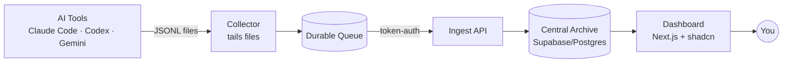
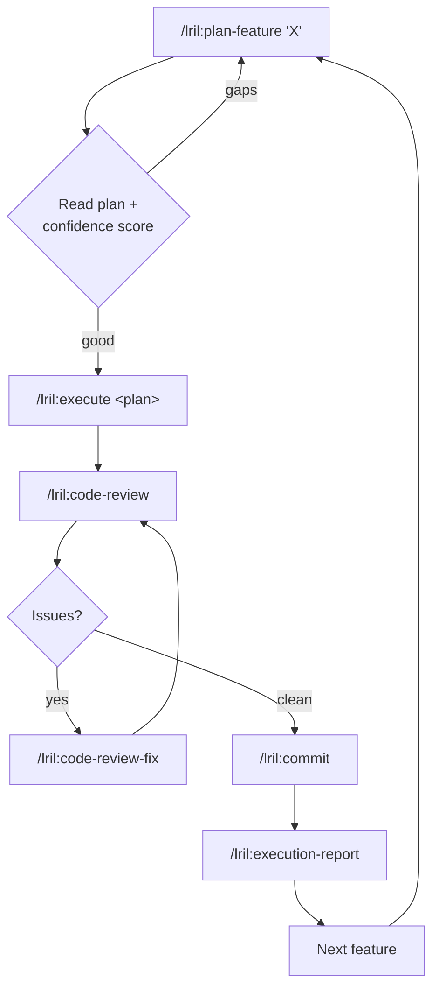

# 420AI — Working Summary & Execution Flow

> A one-page mental model. The full spec is [`docs/PRD.md`](./docs/PRD.md); the domain
> glossary is [`docs/CONTEXT.md`](./docs/CONTEXT.md). This file captures **what we're building,
> how we'll build it, and the decisions made so far.**

---

## 1. What we're building (one breath)

A **self-hosted AI Coding Session Intelligence Platform**: it captures every AI coding-tool
session on your machine(s), archives them with full fidelity, and turns them into Markdown
reports about **cost, token/context efficiency, tool-call failures, and Git outcomes** — so you
can see which projects/tools/models are worth the spend and where context is wasted.

- **Local-first, self-hosted.** Nothing leaves your home server.
- **Event-sourced.** Raw records are the permanent truth; everything else is a re-buildable projection.
- **Deterministic metrics first, AI interpretation second.**

---

## 2. The build LOOP (per feature)

These skills run **once per feature**, not once for the whole project. Walk down the PRD
milestones (§25), running this loop for each:

| Step | Skill | Produces | Code? |
|---|---|---|---|
| 1. Plan | `/lril:plan-feature "<feature>"` | `.agents/plans/<name>.md` + confidence score | No |
| 2. Build | `/lril:execute <plan-path>` | code + tests, runs validations | **Yes** |
| 3. Review | `/lril:code-review` | `.agents/code-reviews/<name>.md` (pre-commit gate) | No |
| 4. Fix | `/lril:code-review-fix` (if needed) | fixes; re-review until clean | Yes |
| 5. Commit | `/lril:commit` | the commit | — |
| 6. Reflect | `/lril:execution-report` | `.agents/execution-reports/<name>.md` (improves next loop) | No |

**Rules of thumb**
- Always **read & correct the plan** before executing — cheapest place to catch a wrong approach.
- `/lril:prime` at the **start of each session** to reload context.
- `/lril:system-review` periodically; `/lril:rca` when something breaks.
- Bootstrap: first feature establishes the conventions every later feature mirrors.

---

## 3. Build ORDER (PRD §25 milestones)

1. Walking skeleton: **one connector (Claude Code) → ingest → store → one report.** No Tauri, no queue, no AI, no redaction.
2. Archive deployment: Docker Supabase, migrations, ingest API, pairing flow.
3. Collector foundation: durable queue, machine identity, ingest sync, connector framework.
4. Thicken first connector to full fidelity, then add Codex + Gemini.
5. Project/workspace mapping (repo discovery + mapping UI).
6. Event projections: sessions, usage, cost, connector health, Git metadata.
7. Reporting: deterministic metrics + Markdown report artifacts.
8. AI interpretation: redacted report bundle + configurable provider.
9. Live Monitor.
10. Hardening: exports, catalog signing, alerts, replay metadata.

> **Principle:** nothing shows value until the pipe is whole — so make the *thinnest* end-to-end
> pipe first (milestone 1), then thicken each stage.

---

## 4. DECISIONS LOG (from PRD review)

### Connector capture (Q1) — confirmed feasible on this machine
| Tool | Location | Format | Liveness |
|---|---|---|---|
| **Claude Code** (required) | `~/.claude/projects/<slug>/<uuid>.jsonl` | JSONL, append | Streaming (tail) |
| **Codex CLI** (required) | `~/.codex/sessions/YYYY/MM/...` + `history.jsonl` | JSONL | Streaming |
| **Gemini CLI** (required) | `~/.gemini/antigravity-cli/history.jsonl` + `brain/<uuid>/.../transcript.jsonl` | JSONL | Streaming |
| **Antigravity** (stretch) | `~/.gemini/antigravity-ide/...` | JSONL + protobuf | Partial — gated |
| **Cursor** (stretch) | `~/.cursor/ai-tracking/ai-code-tracking.db` | SQLite | Snapshot/poll |

**Next action:** full read-only spike → `docs/research/connector-capture-spike.md` (per-connector
feasibility matrix filling PRD §10.3 fidelity fields; key unknown = *does each tool record tokens/cost?*).

### Liveness (Q2) — "as live as the format allows, labeled honestly"
- Watch files, read only **newly appended lines**, push to queue, flush every few seconds.
- Track a per-file **byte-offset cursor** so restarts resume instead of re-sending.
- Liveness is a **per-connector fidelity label**: Streaming (JSONL) / Snapshot (SQLite) / Batch (protobuf).
- Live Monitor shows **"last event N sec ago"** — never fake real-time.

### MVP success criteria (Q3) — contradiction removed
- **Required:** Claude Code + Codex CLI + Gemini CLI (all confirmed JSONL).
- **Stretch / research-gated:** Antigravity + Cursor — ship when verified, never block MVP.

### Git outcome attribution (Q4) — split into two layers
1. **Git metadata** (build now, 100% factual): hash, author, time, branch, changed files, line counts.
2. **Linking** (keep simple): manual link + one heuristic suggestion
   *(same repo + commit within X min of session end + ≥1 file overlap → low/med-confidence suggestion to confirm)*.
   Defer the full weighted scorer. Always show confidence; auto-links are suggestions, not facts.

### Replay reconciliation (Q5) — upsert-by-fingerprint
- **Principle:** raw records are sacred & permanent; normalized events are disposable/re-buildable.
- **Fingerprint** = `hash(source_connector + raw_record_id + event_index + event_type)` — deterministic.
- Re-parse → upsert by fingerprint, stamp `parser_version`. (Same primitive also powers Q4's "already attributed?".)
- Simple now; the stored `parser_version` keeps the door open to versioned generations later.

### Pricing & cost (Q6) — catalog table + fallback ladder
- Pricing lives in the **catalog**: `model → {input/output $/token, source, as-of date}`.
- Ladder: **tool/provider-reported** → else **estimate (model known)** → else **estimate (model unknown)**, each labeled with confidence.
- Updates: **manual trigger first** ("Check for pricing updates"); optional schedule later.

### Security (Q7) — field-level encryption from day one
- **Encrypt:** message bodies, tool-call args/outputs, file contents, command output, detected secrets.
- **Plaintext (queryable):** timestamps, model, project/workspace IDs, token counts, costs, event type, fingerprint.
- Key held by the app/server, **not** in the DB; decrypt only to render or to feed redaction.
- **Tension:** can't full-text-search encrypted data (PRD §21).
  **Resolution:** search a **redacted plaintext projection** (secrets masked); keep originals encrypted.

### Smaller decisions — all accepted
- ✅ **Defer Tauri** — Node/TS collector first (single language), tray app later.
- ✅ **theGridCN** with plain shadcn/ui as fallback.
- ✅ **Defer Parquet** — V1 exports = Markdown / JSON / JSONL / CSV.
- ✅ Add rough **volume/retention** numbers to the PRD.
- ✅ Name a simple **regex/entropy redaction engine** for V1.

---

## 5. Key principles to keep in your head

1. **Raw records sacred, projections disposable** — you can always recompute, so you can never lose data.
2. **Deterministic fingerprint** does double duty: dedup/idempotency (Q5) *and* "already attributed?" (Q4) — design it early.
3. **Thinnest end-to-end pipe first** — value only appears when the whole pipe exists.
4. **Liveness is capped by file format**, not effort — JSONL tails, SQLite polls; label it honestly.
5. **Encrypt originals, search a sanitized copy** — reconciles privacy with search.
6. **Plan-heavy, code-light loop** — read & fix the plan before executing; reflect after to improve the next loop.

---

## 6. Immediate next steps

- [ ] Run the read-only **connector spike** → `docs/research/connector-capture-spike.md`.
- [ ] Fold all decisions above into **`docs/PRD.md`** (success criteria, liveness labels, attribution split, replay principle, pricing ladder, field-encryption + searchable projection, deferrals).
- [ ] Then begin **milestone 1** (walking skeleton) via the build loop.
