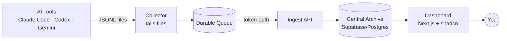
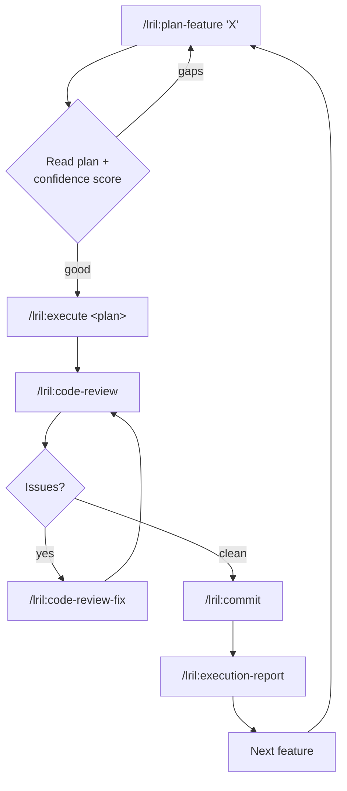

# 420AI — Working Summary & Execution Flow

> A one-page mental model. The full spec is [`docs/PRD.md`](./docs/PRD.md); the domain
> glossary is [`docs/CONTEXT.md`](./docs/CONTEXT.md). This file captures **what we're building,
> how we'll build it, and the decisions made so far.**

---

## 0. Status — 2026-07-22

**V1 is ~95% built.** Milestones **1–9 are implemented and on `main`** (M9 Live Monitor merged via
PR #12). **M10 (hardening)** is a _bundle_ built in slices: the **operational-alerts slice** (the
stateless `deriveAlerts` projection on the M9 snapshot), **3a exports (§22)**, **3b replay metadata
(§23)**, **3c the persisted alert engine**, and **3d catalog signing (§10.4/§18)** are **all done — the
M10 bundle is complete.** 3c added two additive tables (`machine_heartbeats` time-series + `alert_firings`
firing history/ack via a partial unique index; migration `0006`), the `sync.backlog_growing` derivative
layered beside the frozen `deriveAlerts`, an **evaluate-on-read** reconcile inside `buildSnapshot` (no
background dispatcher), and a `/monitor` Ack button; the snapshot stamp bumped `m10-monitor-v1` →
`m10-monitor-v2`. **3d** shipped an ed25519 verify primitive (`@420ai/shared/catalog-signing.ts`, no new
dependency) + a bundled public key + an offline `scripts/sign-catalog.ts` signer (private key offline-only),
the `pricing_catalogs` table (migration `0007`) with a `pending → active` approval gate (partial-unique
≤1 active), four admin endpoints (`POST/GET /v1/catalog`, `:id/approve`, `:id/reject`), **ingest-time
re-pricing under the active catalog** (going forward only; historical replay still deferred), and the
`catalog.update_requires_approval` §20 alert via the existing 3c firing surface. Deferred: the
archive-replay engine (retroactive re-pricing) and making connectors catalog-driven (this bundle is
pricing-only). **M11 (Tauri desktop/tray collector)** — the first _post-V1_ milestone — is **built across
Slices 1–5**: a Tauri (Rust + system-webview) shell that bundles and lifecycle-supervises the headless
collector as a `node:sea` **sidecar** (Rust stays off the capture path), with a tray; a Sync & Health
panel + connector management; GUI pairing + run-on-login autostart + secrets in the Windows Credential
Manager; a Settings panel that supervises the full local server-stack (Docker archive + ingest); and a
local **NSIS** installer. See the slice plans under
[`.agents/plans/`](./.agents/plans/) (`m11-tauri-desktop.md` for the bundle + Slices 1–2, then
`m11-slice{2,3,4,5}-*.md`).

**M12 (Production Readiness / GA)** is **DONE** (planned 2026-06-20 from a deferral audit; completed
2026-06-21). It closed every deferred V1/M11 item — Basic Search + dashboard surfaces (the two V1
functional holes), real admin auth, an ops baseline, the archive-replay engine, alert delivery,
connector hardening, and export/distribution polish — taking the product to **shippable, self-hosted,
single-user GA**. Multi-user/RBAC/SaaS is V2. Sliced 12.1–12.8 in dependency order; see §3, §6, and
PRD §25 M12.

**M13 (Capability Gap Closure)** is **DONE** (post-GA; origin: the 2026-07-07 code-vs-PRD
reconciliation that, after UAT, found the intelligence layer was the thinnest part of the product).
It took the product from "capture-and-archive with a thin intelligence layer" to the **full PRD
promise** by closing every promised-vs-actual gap, in seven dependency-ordered, independently-shippable
slices: **13.1** truth & small fixes (real `lastSyncAt`, two stale doc claims, the updater signing-key
runbook) · **13.2** the 5 missing §15 report types + deterministic §17 context governance · **13.3**
the archive **re-parse** engine (12.5b: server-side decrypt → re-parse → upsert-by-fingerprint +
orphan-GC; the pure parsers relocated to `@420ai/shared`) · **13.4** at-ingest **incremental search** +
rich Markdown/Mermaid report rendering, `<b>` snippet highlight, and list pagination · **13.5** alert
delivery completion (SMTP + a fan-out, deliver-on-resolve, a windowed connector-failure-rate alert;
migration `0012`) · **13.6** OS-cron **scheduled reports** + guided onboarding (`setup`/quickstart/first-run
empty state) · **13.7** the **Cursor** connector (a new SQLite **poll** capture mode). All seven merged
to `main` (PRs #42–#49); the full gate + `--require-db` (0 skipped) stayed green after every slice; the
suite grew 622 → **743** tests. See §6 and PRD §25 M13.

**M14 (General AI Chat Capture + deferral sweep)** is **DONE** (signed off 2026-07-22; planned
2026-07-14 via the same deferral-audit + scope-conversation process that
produced M12/M13; definition + audit in
[`.agents/plans/m14-general-ai-chat-capture.md`](./.agents/plans/m14-general-ai-chat-capture.md)).
**All eight code slices (14.0–14.7) are DONE and on `main`** (PRs #51–#57, each carrying a
code-review and an execution report); the **D-M14-4 pre-sign-off checklist** of maintainer manual
actions (see §6 / the milestone plan) is now **fully cleared** — all seven items verified with
evidence under [`.agents/qa/m14-signoff/`](./.agents/qa/m14-signoff/). It promotes the PRD §25 sketch item 14 — the V2 flagship — into a real milestone:
**14.0** ✅ the capture-surface spike (**DONE 2026-07-14** —
[`docs/research/chat-capture-spike.md`](./docs/research/chat-capture-spike.md): **no chat surface
stores conversations locally**, so capture = official exports (Batch) + a browser extension
(live); gates the connector slices) · **14.1** ✅ truth & hygiene (**DONE 2026-07-14** — README
roadmap, stale deferred-wording sweep, the M10–M13 system-review) · **14.2** ✅ catalog admin UIs
(**DONE 2026-07-15**, PR #52 — dashboard connector-catalog approve/reject + signed pricing-catalog
upload) · **14.3** ✅ desktop polish trio (**DONE 2026-07-16**, PR #53 — `connectorHealth` from the
monitor snapshot + `/api/auth/me` admin-email nav; GUI unpair already shipped in M11 Slice 4) ·
**14.4** ✅ per-event search granularity (**DONE 2026-07-18**, PR #54 — hybrid per-session +
per-message/per-tool-call index) · **14.5** ✅ the Claude
`claude-export` connector (batch, non-repo attribution) · **14.6** ✅ the `chatgpt-export`
(model-attributed, uncosted) + `gemini-export` (Takeout activity log, single-turn sessions,
uncosted/model-less) connectors · **14.7** ✅ browser extension
(near-real-time Claude web capture) + collector **`push`** capture mode — a `127.0.0.1` token-authed
`node:http` receiver + `claude-live` connector + a Claude-only MV3 extension (ChatGPT/Gemini extension
origins deferred; per-origin gate in
[`docs/research/extension-spike.md`](./docs/research/extension-spike.md)). Four scope decisions
(D-M14-1…4) are settled, and the **pre-sign-off checklist** of maintainer manual actions is now
**complete** (2026-07-22, evidence under `.agents/qa/m14-signoff/`): updater signing-key ceremony run
(`tauri.conf.json` carries the real pubkey `274299A5…`; auto-update E2E passed both positive +
negative), restore-from-backup drill, Cursor `watch → archive → Monitor` round-trip, live SMTP send
(local Mailpit), scheduled-reports cold run, and 12.3 auth QA (`.agents/qa/m12-slice3/`).

**M15 (Multi-user & access control) is **DONE** — 15.10 closed it on `2026-08-02`.** Ten slices:
org-level tenancy + RLS backstop, four fixed roles, all four identity paths, sessions, SSO, MFA, API
keys (and the retirement of `ADMIN_TOKEN`), and finally the team surfaces + the append-only
`audit_events` table. **What's next — M16–M19 remain committed and unsequenced.** Originally: On 2026-07-21 the post-V1 bucket
was promoted from a PRD "tentative sketch" to **committed scope** — all five milestones are wanted
(multi-user, SaaS, cross-platform collectors, advanced intelligence, connector ecosystem/local
models); the scope conversation asked for one strategic direction and the answer was all three. On
**2026-07-25** the deferral audit + scope conversation promoted **M15** first, on the stated criterion
(_who the next milestone is for_ — the answer being that this product is going to be a SaaS, so the
tenancy foundation is built now, with one install and zero customers). M16–M19 remain **committed and
unsequenced**.

> **Corrected 2026-07-25 (slice 15.0).** This block previously said "the schema is already
> multi-user-capable, so M15/M16 are a product-surface build, not a data migration." That was true for
> **per-user** isolation, and is **false** under the org-level tenancy settled in **D-M15-1**: the
> tenancy boundary is the **organization**, so `org_id` lands across ~15 tables including `events` and
> `raw_source_records`, with a backfill and `down/` SQL. **M15 is a data migration.** (V1 being
> "single-user in the product, multi-user-capable in the schema" is a separate, still-true claim.)

See §3 for the entries and §6 for the M15 slice status.

**CI gate:** a `repo-health` GitHub Actions check (repo-root `tsc -b` + NUL/stray scans + the full
vitest suite **including the Postgres integration layer**) runs on every PR to `main`
(`.github/workflows/repo-health.yml`).
✅ `repo-health` is a **required** status check on `main` (M12 12.4a) — red PRs **cannot** merge. The
repo is **public**, so branch protection (Settings → Branches → require `repo-health` + require a PR +
no bypass) is free; see `docs/guide/operations.md`. (This closes the gap from M8 / PR #7, which merged
with a typecheck error on the old honor-system rule and needed hotfix PR #8.)

---

## 1. What we're building (one breath)

A **self-hosted AI Coding Session Intelligence Platform**: it captures every AI coding-tool
session on your machine(s), archives them with full fidelity, and turns them into Markdown
reports about **cost, token/context efficiency, tool-call failures, and Git outcomes** — so you
can see which projects/tools/models are worth the spend and where context is wasted.

- **Local-first, self-hosted.** Nothing leaves your home server.
- **Event-sourced.** Raw records are the permanent truth; everything else is a re-buildable projection.
- **Deterministic metrics first, AI interpretation second.**

```mermaid
flowchart LR
    T[AI Tools<br/>Claude Code · Codex · Gemini] -->|JSONL files| C[Collector<br/>tails files]
    C --> Q[(Durable Queue)]
    Q -->|token-auth| I[Ingest API]
    I --> A[(Central Archive<br/>Supabase/Postgres)]
    A --> D[Dashboard<br/>Next.js + shadcn]
    D --> U((You))
```

---

## 2. The build LOOP (per feature)

These skills run **once per feature**, not once for the whole project. Walk down the PRD
milestones (§25), running this loop for each:

```mermaid
flowchart TD
    P["/lril:plan-feature 'X'"] --> R{Read plan +<br/>confidence score}
    R -->|good| E["/lril:execute &lt;plan&gt;"]
    R -->|gaps| P
    E --> CR["/lril:code-review"]
    CR --> Q{Issues?}
    Q -->|yes| F["/lril:code-review-fix"]
    F --> CR
    Q -->|clean| CM["/lril:commit"]
    CM --> ER["/lril:execution-report"]
    ER --> N[Next feature]
    N --> P
```

| Step       | Skill                               | Produces                                                   | Code?   |
| ---------- | ----------------------------------- | ---------------------------------------------------------- | ------- |
| 1. Plan    | `/lril:plan-feature "<feature>"`    | `.agents/plans/<name>.md` + confidence score               | No      |
| 2. Build   | `/lril:execute <plan-path>`         | code + tests, runs validations                             | **Yes** |
| 3. Review  | `/lril:code-review`                 | `.agents/code-reviews/<name>.md` (pre-commit gate)         | No      |
| 4. Fix     | `/lril:code-review-fix` (if needed) | fixes; re-review until clean                               | Yes     |
| 5. Commit  | `/lril:commit`                      | the commit                                                 | —       |
| 6. Reflect | `/lril:execution-report`            | `.agents/execution-reports/<name>.md` (improves next loop) | No      |

**Rules of thumb**

- Always **read & correct the plan** before executing — cheapest place to catch a wrong approach.
- `/lril:prime` at the **start of each session** to reload context.
- `/lril:system-review` periodically; `/lril:rca` when something breaks.
- Bootstrap: first feature establishes the conventions every later feature mirrors.

---

## 3. Build ORDER (PRD §25 milestones)

**V1 (M1–M10):**

1. ✅ Walking skeleton: **one connector (Claude Code) → ingest → store → one report.**
2. ✅ Archive deployment: Docker Postgres, migrations, ingest API, pairing flow, field encryption.
3. ✅ Collector foundation: durable queue, machine identity, ingest sync, connector framework, per-file cursors.
4. ✅ Connectors to full fidelity: Claude Code lifecycle/file/context, then Codex + Gemini.
5. ✅ Project/workspace mapping (repo discovery + attribution resolver).
6. ✅ Event projections: sessions, usage, cost, connector health, Git metadata.
7. ✅ Reporting: deterministic metrics + durable, versioned Markdown report artifacts.
8. ✅ AI interpretation: redaction engine + decrypt-for-render + configurable provider (Anthropic + OpenAI-compatible).
9. ✅ Live Monitor: collector heartbeat → real-time monitor API + SSE → first Next.js dashboard (shadcn/theGridCN).
10. ✅ Hardening: exports, catalog signing, alerts, replay metadata (M10 bundle 3a/3b/3c/3d all done).

**Post-V1:** 11. ✅ **Tauri desktop/tray collector** (Slices 1–5) — Tauri (Rust + system-webview) shell over the
headless collector (`node:sea` sidecar, Rust off the capture path); tray + connector mgmt +
sync/health + GUI pairing + run-on-login autostart + Windows Credential Manager secrets + Settings
that supervises the local server-stack (Docker archive + ingest via Rust `std::process::Command`);
local **NSIS** installer (`npm run build:desktop`). MSI/signed installer + auto-update deferred (§25). 12. ✅ **Production Readiness / GA** — **DONE.** One milestone in thin slices (12.1–12.8) that took the
product from feature-built to **shippable, self-hosted, single-user GA**. Target = self-hosted
single-user; **multi-user/RBAC/SaaS → V2**. **12.1** Basic Search (§21) · **12.2** Dashboard surfaces
(§8.4) · **12.3** Auth hardening (real admin login, retired static `ADMIN_TOKEN`/`DEFAULT_EMAIL`) ·
**12.4** Ops baseline (CI blocking gate, backups + retention, server observability, rate limiting, key
rotation, migration rollback) · **12.5** Archive-replay engine (§23, retroactive re-derive/re-price —
12.5a re-price; 12.5b re-parse landed in M13) · **12.6** Alert delivery (webhook) + remaining §20
conditions · **12.7** Connector hardening (Codex failure classification, per-connector permission
scopes, connector-catalog-as-data; Cursor/Antigravity gates resolved → deferred to M13/V2) · **12.8**
Export/distribution polish (Parquet, restore UI, auto-update; MSI/signed installer parked). See PRD §25 M12. 13. ✅ **Capability Gap Closure** — **DONE** (post-GA, origin: 2026-07-07 code-vs-PRD reconciliation).
A follow-up milestone that closed every promised-vs-actual gap the reconciliation surfaced — taking the
product from "capture-and-archive with a thin intelligence layer" to the full PRD promise. Sliced
13.1–13.7 in dependency order: **13.1** Truth & small fixes (real `lastSyncAt`, stale doc claims,
updater signing-key runbook) · **13.2** Report engine expansion — the 5 missing §15 report types +
deterministic §17 context-governance · **13.3** Archive re-parse engine (12.5b: server-side
decrypt → re-parse → upsert-by-fingerprint + orphan GC; parsers relocated to `@420ai/shared`) ·
**13.4** Incremental search (at-ingest index) + dashboard polish (`<b>` highlight, react-markdown/Mermaid,
pagination) · **13.5** Alert delivery completion (SMTP fan-out, deliver-on-resolve, windowed
connector-failure-rate alert; migration `0012`) · **13.6** Scheduled reports (OS-cron script) + guided
onboarding · **13.7** Cursor connector (SQLite **poll** capture mode). See PRD §25 M13. 14. ✅ **General AI Chat capture (+ deferral sweep)** — **DONE (signed off 2026-07-22; 14.0–14.7 merged, PRs #51–#57)**,
the V2 flagship promoted
from the §25 sketch via the deferral-audit + scope-conversation process. Spike-first (**14.0 gates the
connector slices**), plus three category-B pull-ins (catalog admin UIs, desktop polish, per-event search
granularity) and a truth slice + maintainer pre-sign-off checklist. **The D-M14-4 pre-sign-off
checklist (updater key ceremony, restore drill, auth QA, SMTP, scheduled reports, Cursor round-trip) is
fully cleared — evidence under `.agents/qa/m14-signoff/`.** See
[`.agents/plans/m14-general-ai-chat-capture.md`](./.agents/plans/m14-general-ai-chat-capture.md).

**V2 (M15–M19) — committed scope 2026-07-21; M15 promoted 2026-07-25, M16–M19 still unsequenced.**
The post-V1 bucket stopped being a sketch: the scope conversation asked which single strategic
direction to take and the answer was **all three** — deepen the single-user product, go
multi-user/SaaS, extend cross-platform reach — so all five are committed. The remaining numbering is
inherited from the old PRD sketch and is **not** an execution order; sequencing is driven by **who the
next milestone is for**, not technical dependency. Nothing below M15 is executable until it goes
through the deferral-audit + scope conversation that produced M12/M13/M14. Full entries in PRD §25.

> **Corrected 2026-07-25 (slice 15.0).** This paragraph previously justified the ordering with "the
> schema is already multi-user-capable, so M15/M16 are a product-surface build, not a data migration."
> True for **per-user** isolation; **false** under **D-M15-1**'s org-level tenancy, which adds `org_id`
> across ~15 tables (incl. `events`, `raw_source_records`) plus a backfill. **M15 is a data
> migration** — sizing it from the old sentence under-scopes it.

- **M15 — Multi-user & access control — is **DONE** `2026-08-02`** (promoted 2026-07-25;
  [`.agents/plans/m15-multi-user-access-control.md`](./.agents/plans/m15-multi-user-access-control.md)).
  Org-level tenancy (D-M15-1), RLS as a backstop behind primary application scoping (D-M15-3), four
  fixed roles + per-project grants (D-M15-4), all four identity paths + reset + MFA (D-M15-5),
  `ADMIN_TOKEN` REMOVED and replaced by per-user API keys (D-M15-7; the first-run bootstrap is
  `ADMIN_EMAIL`/`ADMIN_PASSWORD`, which it never seeded). Slices: **15.0** ✅ Truth + RLS spike ·
  **15.1** ✅ Tenancy schema · **15.2** ✅ Request principal · **15.3** ✅ RLS enforcement · **15.4** ✅ RBAC ·
  **15.5** ✅ Identity core · **15.6** ✅ Sessions + revocation · **15.7** ✅ SSO (Google + GitHub) ·
  **15.8** ✅ MFA (TOTP + recovery codes) · **15.9** ✅ API keys + retire `ADMIN_TOKEN` ·
  **15.10** ✅ Team surfaces + audit table.
  **15.0 gates 15.3**; 15.5 gates 15.7; 15.6 gates 15.8.
- **M16 — Cloud-hosted SaaS.** Multi-tenancy, managed archive, quotas/rate limits beyond 12.4,
  billing, hosted onboarding. _Genuinely depends on M15. Biggest architectural shift — local-first
  stays a first-class deployment mode._
- **M17 — Cross-platform collectors.** macOS + Linux (V1/M11 are Windows-first) + portable signed
  installers/auto-update. _Most parallelizable — best candidate to run alongside another milestone._
- **M18 — Advanced intelligence & automation.** Semantic/vector search, scheduled _analysis_,
  in-tool context-rule enforcement, trend/anomaly detection, subscription cost amortization.
  _Deepens data already captured; benefits from M14's larger corpus._
- **M19 — Connector ecosystem & local models.** Script/plugin connector runtime, local-model
  lifecycle, graduating the experimental catalog, mobile consumption app. _Extensibility + breadth._

> **Principle:** nothing shows value until the pipe is whole — so make the _thinnest_ end-to-end
> pipe first (milestone 1), then thicken each stage.

---

## 4. DECISIONS LOG (from PRD review)

### Connector capture (Q1) — confirmed feasible on this machine

| Tool                       | Location                                                    | Format           | Liveness                        |
| -------------------------- | ----------------------------------------------------------- | ---------------- | ------------------------------- |
| **Claude Code** (required) | `~/.claude/projects/<slug>/<uuid>.jsonl`                    | JSONL, append    | Streaming (tail)                |
| **Codex CLI** (required)   | `~/.codex/sessions/YYYY/MM/...` + `history.jsonl`           | JSONL            | Streaming                       |
| **Gemini CLI** (required)  | `~/.gemini/tmp/<projectHash>/chats/session-*.json`          | JSON             | Near-real-time                  |
| **Antigravity** (stretch)  | `~/.gemini/antigravity-*`                                   | JSONL + protobuf | Partial — gated (no token/cost) |
| **Cursor** (stretch)       | `~/.cursor/...` (chat store actually in `%APPDATA%\Cursor`) | SQLite           | Snapshot/poll                   |

**Done:** spike completed → [`docs/research/connector-capture-spike.md`](./docs/research/connector-capture-spike.md).
All three required connectors record **exact tokens + model + tool calls**; none report cost (computed from
tokens × catalog pricing).

### Liveness (Q2) — "as live as the format allows, labeled honestly"

- Watch files, read only **newly appended lines**, push to queue, flush every few seconds.
- Track a per-file **byte-offset cursor** so restarts resume instead of re-sending.
- Liveness is a **per-connector fidelity label**: Streaming (JSONL) / Snapshot (SQLite) / Batch (protobuf).
- Live Monitor shows **"last event N sec ago"** — never fake real-time.

### MVP success criteria (Q3) — contradiction removed

- **Required:** Claude Code + Codex CLI + Gemini CLI (all confirmed JSONL).
- **Stretch / research-gated:** Antigravity + Cursor — ship when verified, never block MVP.

### Git outcome attribution (Q4) — split into two layers

1. **Git metadata** (build now, 100% factual): hash, author, time, branch, changed files, line counts.
2. **Linking** (keep simple): manual link + one heuristic suggestion
   _(same repo + commit within X min of session end + ≥1 file overlap → low/med-confidence suggestion to confirm)_.
   Defer the full weighted scorer. Always show confidence; auto-links are suggestions, not facts.

### Replay reconciliation (Q5) — upsert-by-fingerprint

- **Principle:** raw records are sacred & permanent; normalized events are disposable/re-buildable.
- **Fingerprint** = `hash(source_connector + raw_record_id + event_index + event_type)` — deterministic.
- Re-parse → upsert by fingerprint, stamp `parser_version`. (Same primitive also powers Q4's "already attributed?".)
- Simple now; the stored `parser_version` keeps the door open to versioned generations later.

### Pricing & cost (Q6) — catalog table + fallback ladder

- Pricing lives in the **catalog**: `model → {input/output $/token, source, as-of date}`.
- Ladder: **tool/provider-reported** → else **estimate (model known)** → else **estimate (model unknown)**, each labeled with confidence.
- Updates: **manual trigger first** ("Check for pricing updates"); optional schedule later.

### Security (Q7) — field-level encryption from day one

- **Encrypt:** message bodies, tool-call args/outputs, file contents, command output, detected secrets.
- **Plaintext (queryable):** timestamps, model, project/workspace IDs, token counts, costs, event type, fingerprint.
- Key held by the app/server, **not** in the DB; decrypt only to render or to feed redaction.
- **Tension:** can't full-text-search encrypted data (PRD §21).
  **Resolution:** search a **redacted plaintext projection** (secrets masked); keep originals encrypted.

### Smaller decisions — all accepted

- ✅ **Defer Tauri** — Node/TS collector first (single language); the tray/desktop app is now **M11** (post-V1), sidecar architecture, theGridCN UI.
- ✅ **theGridCN** with plain shadcn/ui as fallback (dashboard **and** the M11 desktop app).
- ✅ **Defer Parquet** — V1 exports = Markdown / JSON / JSONL / CSV.
- ✅ Add rough **volume/retention** numbers to the PRD.
- ✅ Name a simple **regex/entropy redaction engine** for V1 (shipped in M8).

### M11 (Tauri desktop) — resolutions that overrode the bundle plan

These were decided during Slices 1–5 implementation and supersede the open design points the PRD §25
bullet listed for planning:

- ✅ **UI↔sidecar control protocol** — JSON-lines commands/events over the sidecar's stdio, relayed to
  the webview via Rust events. Versioned by `CONTROL_PROTOCOL_VERSION = "m11-control-v2"`, **unchanged
  through Slices 1–5** (pinned by `packages/shared/src/control-protocol.test.ts`).
- ✅ **The app supervises the local server-stack** (Docker archive + ingest) — via Rust
  `std::process::Command`, **not** `tauri-plugin-shell` — injecting keychain secrets as the child
  process env (no `.env` written). Settings manages **server** config only (collector config deferred).
- ✅ **Secrets in the Windows Credential Manager** via the `keyring` crate (pairing token + server-config
  secrets); the webview never reads them.
- ✅ **NSIS, not MSI** — `cargo tauri build` with `targets:"all"` builds both, but the MSI/WiX leg
  (`light.exe`) fails locally; NSIS (`makensis`) is robust. `tauri.conf.json` pins `targets:["nsis"]`.
  MSI + signed installer + auto-update remain **deferred** (PRD §25 defers signed distribution).
- ✅ **Sidecar packaged via `node:sea`** (`apps/collector/scripts/build-sea.mjs`) — bundles
  `collector serve` into one `.exe` as the Tauri `externalBin`. The clean-checkout build recipe (incl.
  the gitignored OneDrive `target-dir` redirect + `cargo tauri icon` regeneration) lives in
  [`apps/desktop/README.md`](./apps/desktop/README.md).

### V1 close-out — scope reconciliation & decisions (2026-06-19)

A **code-vs-PRD reconciliation** (not a plan re-read) surfaced four V1-scope items the milestone
plans had quietly stopped carrying forward. The plans had become the de-facto source of truth, so
anything not re-listed in them dropped from view even while the PRD still required it. Findings +
decisions:

- **Custom file/log watcher connector (§10.1, MVP Success Criteria)** — _silently dropped_: **zero**
  mention anywhere in `.agents/`, yet named twice in the PRD/README as MVP-required.
  ✅ **KEEP in V1 — thin slice.** A minimal config-driven file/log connector on the existing framework
  (`parse` + `watchGlobs`); no schema change. The MVP success criteria stands as written — V1 is **not**
  narrowed to the three first-party connectors.
- **Git Outcome Tracking + Outcome Attribution (§11.3/§11.4)** — _deferred-by-drift_: punted M4 → M6 →
  "its own later slice" and never landed; M6 ships **empty git-field projection plumbing** waiting for
  `git.commit.detected`/`git.diff.detected` events that no connector emits.
  ✅ **KEEP in V1 — FULL (§11.3/§11.4).** Commit + diff capture, changed-file/line stats, and the
  attribution heuristic (manual link + one time-window+file-overlap suggestion, always carrying
  **Attribution Confidence** — see Q4). Restores the README's headline "correlate AI activity with Git
  outcomes" value prop to V1.
- **Basic search (§21)** — _tracked deferral_: M8 deliberately built the redaction engine as its
  substrate. Stays in V1 close-out scope (redacted plaintext projection + Postgres FTS).
- **Dashboard surfaces beyond Live Monitor (§8.4)** — _tracked deferral_ (M9 plan + exec report):
  reports/projects/search/catalog/settings UIs. Stay in V1 close-out scope.

**Consequence:** "V1 ~90% built" held only under that silent narrowing. With both features kept,
**V1 close-out completes to full written scope** — a multi-slice effort (sequenced in §6) of which the
original M10 "hardening bundle" (exports, catalog signing, replay metadata, persisted alert engine) is
**one part**, not the whole.

---

## 5. Key principles to keep in your head

1. **Raw records sacred, projections disposable** — you can always recompute, so you can never lose data.
2. **Deterministic fingerprint** does double duty: dedup/idempotency (Q5) _and_ "already attributed?" (Q4) — design it early.
3. **Thinnest end-to-end pipe first** — value only appears when the whole pipe exists.
4. **Liveness is capped by file format**, not effort — JSONL tails, SQLite polls; label it honestly.
5. **Encrypt originals, search a sanitized copy** — reconciles privacy with search.
6. **Plan-heavy, code-light loop** — read & fix the plan before executing; reflect after to improve the next loop.

---

## 6. Immediate next steps

- [x] **M15 Multi-user & access control — DONE `2026-08-02`** (all ten slices; 15.10 was the last).
      **NEXT: M16–M19 remain committed and unsequenced** — each still needs its own deferral-audit +
      scope conversation before it is executable, and M16 additionally inherits D-15.10-1's deferred
      multi-org membership + org switcher. Promoted 2026-07-25 by the
      deferral-audit + scope conversation that produced M12/M13/M14; decisions D-M15-1…13 are settled
      in [`.agents/plans/m15-multi-user-access-control.md`](./.agents/plans/m15-multi-user-access-control.md).
      Slices run in dependency order; **15.0 gates 15.3** and 15.5 gates 15.7.
  - **15.0** ✅ **DONE `2026-07-25` (PR #60)** — Truth + RLS spike. Corrected the false "not a data
    migration" framing in PRD §25 / SUMMARY §0+§3 and refreshed `docs/CONTEXT.md` V2 scope; wrote
    [`docs/research/m15-rls-spike.md`](./docs/research/m15-rls-spike.md), which proves the
    `DATABASE_URL` role is a **superuser with `rolbypassrls`** (RLS inert against it, and `FORCE
ROW LEVEL SECURITY` does **not** fix it → a non-owner app role is load-bearing), that a plain
    `SET` leaks tenant context across pooled checkouts, and decides the `withOrg` +
    `set_config(…, true)` transaction-wrapping pattern 15.3 implements. **No production code.**
  - **15.1** ✅ **DONE `2026-07-26` (PR #NN)** — Tenancy schema. Migration `0014_loose_pyro` adds
    `organizations` + `memberships` and a `NOT NULL org_id` (+ FK, + `*_by_org` index) to the **15**
    tenant tables, hand-edited into add-nullable → seed one personal org per user → backfill along the
    ownership chain → `SET NOT NULL` → FK/index (drizzle emits `ADD COLUMN … NOT NULL`, which cannot
    run on a populated table, and cannot emit a backfill). Re-scopes `search_documents_entity` to
    `(org_id, entity_type, entity_id)` (audit **B.1**). Every write path fills `org_id` — machine-keyed
    writes derive it from `machines.org_id`, user-keyed writes via `getOrgIdForUser` — with **no public
    repository signature changes** except `createMachine`/`redeemPairingCode`. Behavior-neutral: no read
    gained an org filter, no route/API shape changed. `org_id` is deliberately **absent** from the
    ingest `ON CONFLICT DO UPDATE set:` block so a converging cross-org re-ingest cannot flip a row's
    owner (D-M15-2, pinned by `tenancy.int.test.ts`); the `events` PK is still `fingerprint` alone. The
    D-M15-13 rollback drill ran on a clone of the real 413,765-event archive — up ≈22 s, down ≈8.8 s,
    re-up ≈22.7 s, 0 null `org_id`, 1 personal org — evidence in
    [`.agents/qa/m15-signoff/`](./.agents/qa/m15-signoff/).
  - [x] **15.2** Request principal — DONE `2026-07-26` (PR #NN). `adminAuthorized` (boolean) is
        DELETED in favour of `resolvePrincipal(app, request) → {userId, email, orgId, role} | null`,
        backed by a one-query `findPrincipalByEmail` (users ⨝ memberships); all 45 gates across 16 route
        files converted, and all 20 `app.adminEmail` re-resolutions removed — `GET /v1/auth/me` now
        returns the CALLER's email. `orgId` threaded into every read the spikes proved spans tenants:
        `sessionDetail`, `sessionTranscript`, the five M6 rollups, `projectEventSummary`,
        `searchDocuments`, `getReportArtifact`, the session-keyed attribution reads — PLUS five the plan
        did not enumerate (`toolStatsByModel`, `failureSeries`, `failedToolBreakdown`,
        `contextPathSample`, `gitCommitsByProject`) and the project ownership surface
        (`getProjectName`/`renameProject`/`archiveProject`, which were unscoped **writes**). The
        `report_artifacts_scope_version` race is fixed by a bounded 12-attempt retry around the whole
        transaction (8 concurrent generations → 8 contiguous versions, 0 failures). `server.ts` now
        seeds the bootstrap admin IDENTITY unconditionally, so `ADMIN_TOKEN` keeps working on
        token-only deployments (it previously existed only when `ADMIN_PASSWORD` was set).
        Role is resolved but NOT enforced (enforced in 15.4); RLS backstop is 15.3.
  - [x] **15.3** RLS enforcement — DONE `2026-07-26` (PR #NN). The **backstop** behind 15.2's
        application scoping (D-M15-3). A non-owner role `420ai_app` (`rolsuper=f`,
        `rolbypassrls=f`) is what the ingest server now connects as — without it RLS is INERT and
        every policy decorative, so `server.ts` **hard-fails without `DATABASE_URL_APP`**
        (D-15.3-2). Migration `0015` puts 15 tables behind a policy keyed on a transaction-local
        `app.current_org`: **12 STRICT** (unset context ⇒ 0 rows, not a 500 — the `nullif(…,'')`
        guard) and **3 BOOTSTRAP-PERMISSIVE** (`machines`/`ingest_tokens`/`pairing_codes`, because
        the credential lookup that DISCOVERS the org must itself run, D-15.3-3). `withOrg`
        (`set_config(…, true)`, never `SET LOCAL` — Postgres rejects a bind param there) wraps every
        principal- and machine-authed handler; the three deployment-wide ops iterate **per org**
        rather than taking a privileged connection, so the server has **zero** cross-org seams
        (D-15.3-5). Proven by a **two-role** suite: dropping one policy fails 7 of 9 tests.
        `repo-health --require-db` now also asserts the RLS role is non-bypassing — `bypassed ≠
enforced`, the sibling of `skipped ≠ passed`. Closes the Spike-6 hole: a cross-org
        converging ingest used to silently overwrite the other tenant's row and is now rejected.
        Audit B.4 (alert-reconcile throttle) moved to 15.4 (D-15.3-7).
  - [x] **15.4** RBAC — DONE `2026-07-27` (PR #NN). The slice that makes an org able to hold more
        than ONE user, which is why three things had to land together. (1) **Roles become real**:
        an ordered ladder `viewer < member < admin < owner` in `@420ai/shared`, one `authorized()`
        gate on all **45** principal-authed handlers, and an RLS **write** backstop — migration
        `0016` adds **39 RESTRICTIVE** policies (13 tables x INSERT/UPDATE/DELETE) reading a second
        transaction-local `app.current_role`. Restrictive policies AND with permissive ones, so
        15.3's 15 org policies are **untouched**. INSERT/UPDATE are LOUD (`WITH CHECK`); DELETE is
        unavoidably a silent `DELETE 0` — Postgres has no `WITH CHECK` for it — so the route gate is
        the only loud layer for deletes, asserted explicitly rather than hidden. (2) It closes the
        **`userId`-only read backlog** (12 reads). Adding `org_id` was not enough: those reads had
        TWO defects wearing one face — RLS was the only tenant boundary (inverse of D-M15-3) AND the
        result was only correct while every org held one user. Nine are now scoped by **org
        instead of** user (D-15.4-2: every member sees every machine/project/workspace in their
        org); `listAlertFirings`, `createProject` and `resolveWorkspaceId` keep `user_id` for
        reasons stated at each. (3) It moves the alert reconcile **off the SSE hot path** (audit
        B.4, inherited via D-15.3-7): throttled to once per 30 s per `(org,user)`, injectable, `0`
        reproducing pre-15.4 behaviour exactly. Also: `project_grants` (grants **ELEVATE, never
        demote**, so a solo install holds zero rows and is byte-identical to 15.3), the catalog
        approver is the real `principal.email` rather than the literal `"admin"` (audit B.6), and
        D-15.4-5 records that connector approval is machine-local, NOT org RBAC. Proven by
        `rbac.int.test.ts` — **two Postgres roles, three users, ONE org**, a configuration that had
        never existed; neutralising one policy to `WITH CHECK (true)` turns the backstop tests red.
        Two things the suite caught that no type could: a viewer's `GET /v1/monitor` **500ed**
        because evaluate-on-read makes a GET a WRITE (fixed with `SERVICE_ROLE`, the same call the
        plan already made for alert delivery), and seeding a second org member by INSERT is
        shadowed by the personal `owner` membership `setUserPassword` creates.
  - [x] **15.5** Identity core — DONE `2026-07-28` (PR #65). 15.4 gave an org a role ladder; it did
        not give it a way to acquire a SECOND HUMAN. This ships the identity core — **member CRUD**,
        **invite-by-email** over 13.5's SMTP transport, **password reset**, **gated self-signup** —
        and closes the **account pre-seeding primitive** (D-M15-8 / audit C.9), which is why it
        GATES 15.7: pre-seeding plus SSO auto-link-by-email is an account-takeover chain, and 15.7
        is where the second link lands. `POST /v1/pairing-codes` no longer upserts a `users` row
        from a caller-supplied email; it resolves an EXISTING member of the caller's org and 404s
        otherwise, so the route creates nothing (proven by a `count(*)` assertion, not a status
        code, and by a repo-wide `insert(users)` grep that now finds only `repositories/users.ts`).
        Migration `0017` adds two tables on OPPOSITE sides of D-15.3-4's line (D-15.5-1): `invites`
        is ORG-owned and `password_reset_tokens` is IDENTITY-owned, so the first gets policies and
        the second gets none. `invites` is the first table in the repo needing **both axes at
        once** — bootstrap-permissive on ORG (the accept path reads the row IN ORDER TO discover
        the org) and RESTRICTIVE on ROLE (an invite GRANTS PRIVILEGE, so a viewer minting
        `role:'owner'` is exactly what the 15.4 backstop is for). Postgres makes that sound rather
        than contradictory — RESTRICTIVE combines with `AND`, PERMISSIVE with `OR` — and it earns a
        THIRD classification constant in `rls.int.test.ts` rather than being forced into an
        existing one, where it would have been silently exempted from both checks. 0017 also
        **lowercases every `users.email`** and `normalizeEmail` now guards every boundary
        (D-15.5-3): a spike proved `users_email_unique` is a plain btree on `email`, so
        `Foo@x.com` and `foo@x.com` were two accounts — the other half of the same takeover chain,
        since 15.7 links identity by email. Guards: **never grant above your own rung**
        (D-15.5-11, route layer — RLS only ever asks "is this a viewer?"), a **last-owner** guard
        counting owners inside the mutating transaction (D-15.5-12, repository layer so it holds
        for any future caller), self-signup **OFF unless `SELF_SIGNUP_ENABLED=true`** and creating
        a NEW personal org rather than joining one (D-15.5-6), an always-202 reset request
        (D-15.5-7, OWASP: a 404 would be a user-enumeration oracle), and an asymmetry with no
        mailer configured (D-15.5-10) — the admin-gated invite returns its token, the
        UNAUTHENTICATED reset **503s**, because handing a reset token to an anonymous caller is a
        complete takeover primitive. The hardest boundary is D-15.5-9: an invite to an email that
        already has a user is **409**, not a second membership, because `findPrincipalByEmail`
        resolves the FIRST membership by `(created_at, id)` and every existing user already owns a
        personal org that predates any invite — the row would be permanently shadowed. That same
        trap is why the accept path calls `createUserWithPassword` (the ONE users-insert that skips
        `ensurePersonalOrg`) and **never** `setUserPassword`; `identity.int.test.ts` pins it with a
        membership-COUNT assertion that was CONFIRMED to fail under the wrong call before being
        left green. Sessions were deliberately NOT invalidated on password change at this slice —
        they were stateless HMACs, and half-revocation would have been indistinguishable from
        working revocation. **15.6 closed that** (D-M15-12). Proven by two new **two-role** suites
        (24 HTTP + 11 repository tests):
        the HTTP one validates the primary defence, the repository one the predicates — and there
        the split matters more than usual, because `memberships`/`users` carry **no RLS at all**,
        so a forgotten `orgId` predicate has no backstop behind it.
  - [x] **15.6** Sessions + revocation — DONE `2026-07-28` (PR #66). 15.5 shipped invites, signup
        and password reset onto a session that was a **stateless HMAC with no server-side record**,
        so the only revocation available was rotating `SESSION_SECRET` — which signs out the whole
        deployment. Migration `0018` adds a `sessions` table and the token gains a `sid` claim
        (D-15.6-1: keep the HMAC rather than switching to opaque tokens, or the dashboard's Edge
        middleware would need a network hop per navigation; a spike proved the extra claim
        round-trips through `crypto.subtle` untouched, so **no dashboard verifier change**).
        `sessions` is an IDENTITY table — no `org_id`, **no RLS policy at all** (D-15.6-3), joining
        `users`/`memberships`/`password_reset_tokens` in `NO_RLS_TABLES`, because it is read INSIDE
        `resolvePrincipal` at the one moment before any org context exists. It stores **no
        `token_hash`** (D-15.6-2), departing from `invites`/`password_reset_tokens`: those hold a
        bearer secret that IS the credential, whereas a session's credential is the HMAC and the
        `id` is a lookup key — hashing it would imply a protection that is not there. There is
        **one** enforcement point, `resolvePrincipal`, and three triggers: explicit
        (logout / revoke-one / revoke-all), credential change, and member removal. The two
        asymmetries are deliberate and each is pinned: a password **reset** kills every session
        (OWASP; the caller is unauthenticated and somebody else may hold one) while a password
        **change** spares the caller's own (D-15.6-6); member **removal** revokes while a **role
        change** does not (D-15.6-7), since `role` is re-resolved per request. There is deliberately no
        `last_used_at` (D-15.6-8) — it would put a WRITE on every authenticated read — and
        `user_agent` is truncated to 256 chars at the route (D-15.6-9), since it is
        attacker-controlled text that is later rendered. Pre-0018 (`sid`-less)
        tokens are **rejected, not grandfathered** (D-15.6-5) — everyone logs in once — because a
        grace period is a window in which revocation silently does not apply.
        **The proof needed a new shape.** 15.3/15.5 proved their claims by dropping an RLS policy
        and watching tests fail; there is no policy here to drop, and the failure mode is nastier —
        a revoked session that still works reports **nothing**: no error, no log, a 200, and every
        existing test stays green because they all use freshly-minted tokens. So the suite's
        discriminating assertion is that a rejected token is **still cryptographically valid**
        (`verifySession` non-null, `exp` in the future) at the moment it 401s, which excludes
        expiry, tampering and a wrong secret as explanations. Keeping `verifySession` a pure
        crypto check with no database in it is what makes that assertion possible, so the split is
        load-bearing rather than stylistic. The mutation check (revocation lookup removed) failed
        12 of the 23 HTTP tests with **all positives still passing** — and surfaced one finding: the
        member-removal test PASSED under the mutation, because a removed membership already fails
        closed via `findPrincipalByEmail`. That accidental mechanism (the one 15.6 replaces, and
        the one that evaporates when 15.10 ships multi-org users) is now named in the test itself.
        **A SECOND, ADVERSARIAL REVIEW PASS found the two defects the first missed, and both were
        the slice's own failure mode turned on itself.** (a) Revocation did not reach an OPEN SSE
        stream: `GET /v1/monitor/stream` hijacks the socket and was gated once, at connect, so a
        revoked — or REMOVED — user kept receiving the org's live snapshot indefinitely, kept
        driving its reconcile writes and kept firing its outbound alerts. Proven against a live
        server. The gap was the smaller half: the code ASSERTED there was no second enforcement
        point, and the test claiming to sweep "every authenticated route" was built on
        `app.inject`, which cannot observe a hijacked socket — `bypassed ≠ enforced`, one layer out.
        Fixed with a per-tick session re-check (one PK probe on a tick that already spans eight
        reads) and a regression test on a real `listen()`. (b) A login racing a password RESET
        survived it — the login inserts its row after the reset's blind `UPDATE` has run past, so a
        session minted from the OLD password stayed valid for 7 days, exactly the takeover-recovery
        failure D-15.6-6 exists to close. Fixed with a `FOR SHARE` lock on the user row held across
        the login's scrypt, so either the reset waits and revokes the new row or the login
        re-evaluates and refuses. Its FIRST regression test was written at the HTTP layer and passed
        identically with and without the lock — CLAUDE.md's "concurrency test at the wrong LAYER"
        lesson, walked into rather than remembered — so it was rewritten at the repository layer
        with two hand-held transactions. Two new **two-role** suites (23 HTTP + 15 repository) plus
        a dashboard logout ORDERING test, every behaviour-changing fix verified to FAIL without it,
        and the D-15.6-4 residual documented
        rather than hidden: the Edge middleware cannot see revocation, so a revoked-but-unexpired
        cookie renders the dashboard **shell** while every data fetch 401s. Closing it would cost a
        network hop per navigation for no security gain — ingest is the boundary.
  - [x] **15.7** SSO (Google + GitHub) — DONE `2026-07-29` (PR #67). The fifth and last way to
        become a 420AI user before MFA, and the first that is not a password. `sso_identities` is
        keyed on **`(provider, subject)`** — the provider's immutable id (Google `sub`, GitHub
        numeric `id`), never a username and **never an email** (D-15.7-1): `findUserIdBySsoIdentity`
        does not accept an email **as a matter of signature**, so email fallback is not something a
        later edit can quietly add. The stored `email` is display/audit only. Another IDENTITY table
        — no `org_id`, no RLS (D-15.7-3), joining `users`/`memberships`/`password_reset_tokens`/
        `sessions` in `NO_RLS_TABLES`, so migration 0019 adds a table and **no policy** and every
        derived policy count is unmoved. No OAuth/JWT/Octokit dependency: plain `fetch` +
        `node:crypto`, and the `id_token` signature is deliberately **not** verified (D-15.7-2) —
        OIDC Core §3.1.3.7 permits skipping it for a token fetched directly from the token endpoint
        over TLS, which drops a JWKS cache and makes Google and GitHub the same shape (exchange →
        access token → profile endpoint). GitHub is the awkward one on purpose: no `id_token`, the
        verified flag lives behind a second call to `/user/emails`, and PKCE is undocumented there
        so `usesPkce: false` while `state` stays mandatory.
        **The slice is its refusal.** A verified provider identity asserting a **pre-existing**
        address is never adopted — 409 `link_required`, no session minted and no identity row
        written (D-15.7-4). The rule is unconditional here rather than limited to unverified rows,
        because **no `users` row in this codebase has a verified email**: 15.5's signup sends no
        verification mail and pre-seeded pairing rows were never verified at all, which is why
        D-M15-8 was a hard prerequisite. The escape hatch is an **authenticated** link endpoint,
        surfaced in `/settings`. SSO-driven signup is gated by its **own** `SSO_SIGNUP_ENABLED`,
        default off (D-15.7-7) — separate from `SELF_SIGNUP_ENABLED` so an operator can open SSO
        self-provisioning without opening password signup, and defaulting it on would silently
        reopen the door D-M15-6 shut. `redirect_uri` is derived server-side from `APP_BASE_URL` and
        is absent from the request schema entirely (D-15.7-6); no provider access or refresh token
        is stored (D-15.7-5) — this is identity, not API access, so 12.3's rejection of GitHub
        OAuth is superseded on different grounds rather than overturned.
        Proven by two new **two-role** suites (25 HTTP + 14 repository) plus 11 dashboard callback
        tests, and the discriminator was verified by MUTATION rather than asserted: implementing
        adoption in place of branch 4 made the takeover test fail on its **409 expectation with a
        clean 200** while the role-identity, positive, isolation and unlink tests all stayed green
        — the split the plan predicted. Two facts the suites measured rather than assumed: Fastify's
        ajv **strips** an unknown `redirectUri` instead of 400ing it, so the D-15.7-6 proof had to
        become "what the provider actually received"; and the unlink guard's race is only visible
        at the **repository** layer with two hand-held transactions (CLAUDE.md's 15.5 corollary,
        applied rather than relearned), with the held connection released in a `finally`.
  - [x] **15.8** MFA (TOTP + recovery codes) — DONE `2026-07-30` (PR #68). The last identity slice, and the
        one that makes the other five paths mean something: after 15.5-15.7 there were five ways to
        become authenticated and **all five terminated in a single-factor secret**, over an archive
        holding decrypted transcripts for a whole org. A **zero-dependency** TOTP core
        (`apps/ingest/src/mfa/totp.ts` — RFC 4226 HOTP + RFC 6238 TOTP + RFC 4648 base32, checked
        against the RFCs' own published vectors) follows `password.ts`'s scrypt precedent and keeps
        the `node:sea` sidecar build untouched (D-15.8-1). Two new **identity** tables —
        `totp_credentials` (one row per user, secret **encrypted at rest**, D-15.8-6) and
        `mfa_recovery_codes` (sha256-hashed, single-use, D-15.8-7) — with no `org_id` and no policy
        (D-15.8-13), joining `NO_RLS_TABLES`; migration `0020`. Enrolment is **two-phase**
        (D-15.8-10): `confirmed_at IS NULL` gates nothing, so an abandoned enrolment never locks
        anyone out. THREE THINGS ARE THE SLICE. (1) Login splits into _authenticate now, mint later_,
        which reopens the race 15.6 closed with a `FOR SHARE` lock held across scrypt — the new gap
        spans a human reading a phone, and no lock reaches across it. The fix is a
        **credential-version fingerprint** carried in the challenge and re-checked under THE SAME
        lock (D-15.8-4), so a password reset mid-flow voids the challenge and a verify-first ordering
        still has its session revoked; the 5-minute TTL is a bound, **not** the mechanism. (2) The
        challenge is **stateless and domain-separated** (D-15.8-3), signed under a key _derived_ from
        `SESSION_SECRET` — a challenge that verified as a session would be a total MFA bypass, so the
        derived key makes it **unrepresentable** rather than merely unreached, asserted in both
        directions against the real `session.ts`. (3) **The SSO callback goes through the same gate**
        (D-15.8-5): one shared `mintSessionOrChallenge`, because "enable MFA unless the attacker uses
        the Google button" is not MFA. Replay is refused by a monotonic `last_step` (RFC 6238 §5.2 /
        D-15.8-8, `integer` not `bigint` — `int8` arrives as a JS **string**); attempts are throttled
        by a per-user atomic increment (RFC 4226 §7.3 / D-15.8-9), because a stateless challenge has
        nowhere to count and per-IP limits do not bound an attacker who already holds the password.
        `reencryptAll` gains a fourth pass, or its "every encrypted row under the active key" promise
        would be false. Two **two-role** suites (23 HTTP + 15 repository); the HTTP suite's central
        fact is asserted OUT OF BAND through the owner handle — **a login that reports `mfaRequired`
        must have written no `sessions` row**, since a handler that returns the challenge AND mints a
        session looks perfectly correct from the client. Two lessons re-learned by measurement rather
        than memory: the obvious atomic-increment test — a bare `Promise.all` of two calls — **passed
        against a deliberately broken read-then-write**, because unsynchronised calls on a pool
        serialise on their own (CLAUDE.md 15.5's wrong-layer corollary, in a new costume); it needed a
        held `FOR UPDATE` prelude to separate the two implementations deterministically. And the ±1
        skew window plus a monotonic `last_step` means there is exactly ONE unspent step per 30-second
        window, which is correct per the RFC and visible to users for ~30 s after enrolling —
        documented in the operations guide rather than filed as a bug. The code review then found the
        slice's own asymmetry, fixed before merge (**D-15.8-16**): `enroll` was session-gated and
        nothing more, while `disable` demanded a live code on the reasoning that "a stolen session
        cookie must not be able to switch the second factor OFF" — an argument that applies verbatim
        to switching it ON and had simply not been made. Reproduced end to end: an attacker holding
        only a cookie enrolled, `enroll/confirm`'s revoke-all signed the owner out, and **a full
        password reset did not recover the account** (nothing on the reset path clears
        `totp_credentials`), leaving operator DB access as the only way back. Enrolment now re-proves
        the current password, or — for an SSO-only account, which has none — requires a session under
        15 minutes old; the fix is deliberately NOT "make password reset clear MFA", which would let
        mailbox access strip the factor and defeat the slice. **Deferred to 15.10, stated as
        deferred:** QR rendering (D-15.8-14) and any org-level "require MFA" policy (D-15.8-2); there
        is deliberately **no** admin "reset MFA for user X" endpoint, since it needs 15.5's full rank
        ceiling-and-floor plus an audit record — break-glass is direct DB access (D-M15-7)
  - [x] **15.9** API keys + retire `ADMIN_TOKEN` — DONE `2026-08-01` (PR #69). The last CREDENTIAL
        slice, and the one that closes M15's own oldest hole: `ADMIN_TOKEN` violated every property
        the previous nine slices established — **un-attributable** (every holder resolved to the same
        bootstrap admin, so 15.10's audit table would have recorded one identity for three clients),
        **un-revocable** (revoking meant editing env + restarting, for _all_ clients at once),
        **un-expiring**, and **always `owner`** (so `scripts/generate-reports.mjs`, which only POSTs
        reports, held the whole deployment). It replaces that with a per-user `api_keys` **identity**
        table — `user_id`, no `org_id`, no policy (D-15.9-1), joining `NO_RLS_TABLES`; migration
        `0021`, the fourth in a row whose missing policy block IS the decision — holding a sha256 hash
        (D-15.9-2, never the plaintext, which is returned exactly once) behind a `k420_` prefix.
        **The prefix is routed with `startsWith` and never a split on `_`**, and that is a measured
        design change rather than a style note: base64url's alphabet INCLUDES `_` and `-`, so a token
        body routinely contains underscores and `split("_")[1]` would mis-handle a random fraction of
        valid keys — presenting as "API keys are flaky", not as a parsing bug. THREE THINGS ARE THE
        SLICE. (1) **The effective role is a `min`, not a mint-time cap** (D-15.9-4): the lower of the
        key's own rung and its owner's CURRENT membership rung, re-derived every request — so
        demoting someone demotes their keys on the NEXT call rather than whenever somebody remembers
        the key exists. A cap passes every other test in the suite (the key works, it is capped at
        issue, it revokes); only the demote-after-mint assertion tells the two designs apart. A
        stored role outside `ROLES` is REJECTED, not clamped. (2) **The SSE re-check**, which was the
        slice's sharpest risk: `monitor.ts`'s per-tick skip was justified in prose _entirely_ by
        `ADMIN_TOKEN` being "un-revocable by construction" — true of that tier and FALSE of a key, so
        inheriting the comment would have silently re-opened, one tier over, the exact hole 15.6
        closed. Keys are now probed every tick with `isApiKeyLive`, which deliberately does NOT stamp
        `last_used_at` (that would be a write per tick per connected client — audit B.4). Mutation-
        proven: deleting the probe fails that one test and nothing else. (3) **Minting requires
        re-authentication** (D-15.9-6) — a long-lived credential minted from a stolen cookie outlives
        the session it came from — via the 15.8 gate **extracted** into `reauth.ts` rather than
        copied, since two copies of an auth check drift invisibly to `tsc`. Listing and revoking are
        deliberately ungated: revocation must never be harder than minting. Member removal revokes
        keys in the same transaction as sessions (D-15.9-9); a password change deliberately does not,
        a stated asymmetry rather than an oversight. Then Phase C **deleted the tier**: the auth
        branch, the `buildApp({ adminToken })` option, the `server.ts` throw, and 33 occurrences
        across 24 test files converted to real minted keys through ONE `seedBootstrapKey` helper —
        the option is GONE rather than left inert, because an option that authenticates nothing is
        precisely the false guarantee this repo has been burned by. `grep -rn "adminToken"` over
        `apps/ingest/src packages/*/src` returns 0, and a test asserts the retired literal now 401s.
        Two new **two-role** suites (24 HTTP + 17 repository) plus 14 unit tests over the extracted
        `effectiveApiKeyRole`/`shouldTouchApiKey`; the `expires_at IS NULL` regression was
        negative-control verified (a bare `gt` fails 8 of 17). Two process notes worth keeping: the
        plan's `API_KEY || ADMIN_TOKEN` fallback was **deliberately not shipped** — correct for a
        Phase-B-only landing, but after Phase C it would turn a fixable config error into an opaque
        401 on an unwatched cron job, so the script names the migration instead; and OneDrive again
        deleted three tracked files mid-run and left a `-Living-Room` conflict copy,
        caught by `git status` rather than by any gate.
  - [x] **15.10** Team surfaces + audit table — DONE `2026-08-02` (PR #NN). **THE LAST SLICE, and
        the one that made nine headless slices usable.** Nine slices shipped a complete multi-user
        backend and **zero** user-facing surface for it; most sharply, `members.ts` had been mailing
        every invited colleague a link to `/invite/<token>` since 15.5 and **that page did not
        exist**, so the milestone's flagship onboarding path dead-ended on a 404 and the only way to
        add a colleague was to read the token out of a JSON response and pass it over chat. Shipped:
        `/invite/[token]` (public, redeems and lands the new user logged in), `/team` (roster,
        pending invites, all four mutations, a `viewer` seeing the roster and no controls),
        `<ApiKeysCard/>` and `<OrgCard/>` on `/settings`, eleven proxy route handlers,
        `GET`/`PATCH /v1/org`, and `DELETE /v1/members/:userId/mfa` — the admin MFA reset 15.8
        designed and **refused to ship** without 15.5's rank ceiling-and-floor plus an audit record.
        Both now exist, so the remedy for a colleague who changed phones is no longer `psql`.
        **`audit_events` is a FOURTH RLS classification: APPEND-ONLY** (D-15.10-2), and the design was
        settled by a 15/15 live spike **including a negative control**. Ten actions, one policy —
        `PERMISSIVE ... FOR INSERT WITH CHECK (true)` — with no `SELECT`/`UPDATE`/`DELETE` policy at
        all and `REVOKE UPDATE, DELETE` from `420ai_app`. The strict 13-table pattern was **measured
        to be unusable**: audit writers straddle the org-context boundary (`members.ts`/`org.ts` are
        wrapped; `api-keys.ts`/`auth.ts`/`sso.ts` are the allow-listed identity routes with NO
        context), and a strict policy REJECTS the unwrapped half — it would have made every
        `api_key.minted` a 500 surfacing later as "minting is broken". Net: the app **appends always,
        reads ZERO rows even WITH a matching org context** (the ABSENT SELECT policy, not a failing
        predicate — so write-only is a database guarantee), and **cannot** rewrite history; the owner
        reads everything (D-M15-7 break-glass, which is why `FORCE` is deliberately OMITTED against
        all 17 tenant tables, asserted `= false` on purpose). `REVOKE` is what turns a blocked
        `UPDATE`/`DELETE` from a **silent 0-row no-op** into a loud `permission denied`. Audit writes
        are **in-transaction with the action** (D-15.10-3), never best-effort: a failed audit fails
        the action, because "the change committed but nobody knows who made it" is the worse
        outcome. The negative control was **re-run and observed**: with the policy replaced by
        `FOR ALL USING (true)`, tests 3 and 4 of `audit.int.test.ts` fail, then pass again restored.
        **D-15.10-1 CORRECTS ELEVEN SOURCE COMMENTS**: multi-org membership + the org switcher were
        promised "at 15.10" in eleven places (including two 409 **response bodies**) and are
        **deferred to M16** — they reopen `findPrincipalByEmail`, the load-bearing 15.2 primitive
        whose byte-identical `ORDER BY` is the only thing keeping session-auth and key-auth resolving
        to the same org, and additionally need an active-org session claim, per-org revocation and a
        rewrite of the invite refusal. Nothing in 15.10's UI needed it. The 409 bodies now read
        "a user may belong to only one organization" and name no milestone at all. Also corrected:
        D-15.10-5 keeps `MAX_API_KEYS_PER_USER` at 25 and **deletes the promised revisit** rather
        than changing a number on no evidence (the UI landed; the "real data" still does not exist —
        one install, one human), and both stale desktop strings that told users to wait for this UI.
        Three traps worth keeping: **the middleware and the nav both match public paths by EXACT
        EQUALITY**, so a dynamic `/invite/<token>` can never match — the same trap `/login/mfa` fell
        into twice, and it fails looking exactly like a backend bug (every invitee bounced to
        `/login?next=/invite/<token>`, a page they have no account for, with their one-time token in
        the query string). Pinned this time by a unit test, which required extracting the predicate
        to `lib/public-paths.ts`. **Fastify's default ajv runs `removeAdditional`**, so
        `additionalProperties: false` STRIPS an unknown key rather than 400ing — the first version of
        the cross-org rename test asserted the wrong contract. And the audit assertions **must read
        back on the OWNER handle**: through the app handle every one passes vacuously against zero
        rows. **Deferred and stated, not dropped**: multi-org/org switcher (M16), an audit-log viewer
        or export (D-15.10-4 — a structural test asserts the repository exports no reader), and four
        surfaces that stay headless but curl-reachable (gated self-signup, password-reset pages, an
        active-sessions list, MFA QR — the last held by the slice's no-new-dependency rule).

- [ ] **M16–M19 remain committed scope, unsequenced** (§3, PRD §25). Each still needs its own
      deferral-audit + scope conversation before it is executable.

- [ ] **V1 close-out** (scope confirmed 2026-06-19 — see §4) — completed to **full written scope**.
      Sequenced slices, each run through the build loop (§2). Recommended order is value/dependency-first: 1. **Git Outcomes & Attribution** (§11.3/§11.4, full) — capture commits (hash/author/time/branch +
      changed-file/line stats, reverts) per repo into **dedicated `git_commits`/`git_commit_files`
      tables** via a new machine-authed `POST /v1/git` (M7-style: dedicated tables, NOT `events`-table
      rows — `/v1/ingest` + the fingerprint stay untouched; the commit SHA is the idempotency key).
      Plus a `session_git_links` side-table + the attribution heuristic (manual link + one suggestion,
      Q4) carrying **Attribution Confidence**, reusing M8 decrypt-for-render for file-overlap. (M6's
      git-_branch_ projection already works off tool events — commits are genuinely NEW data, not
      "empty plumbing.") Plan + Phase-0 spike done →
      [`.agents/plans/m10-slice1-git-outcomes-attribution.md`](./.agents/plans/m10-slice1-git-outcomes-attribution.md).
      _Headline value + unblocks richer reports/search/dashboard — do first._ 2. **Custom file/log connector** (thin) — config-driven connector on the existing framework; no
      schema change. Restores the MVP-criteria connector. _Small, independent — quick win._ 3. **M10 hardening bundle** — itself four sub-slices (recommended internal order **3b → 3a → 3c → 3d**): - ✅ **3a — Exports** (§22) — **DONE.** Shipped MD/JSON/JSONL/CSV portable bundles, scoped by
      project/time/session/report/connector; **redact before anything leaves the archive**;
      decrypt-for-render only when the scope includes raw content. _No schema change._ - ✅ **3b — Replay metadata** (§23) — **DONE.** Shipped `PRICING_CATALOG_VERSION="m10-catalog-v1"` + nullable `catalog_version` (events + report*artifacts) and `analysis_version` (report_artifacts)
      columns (migration `0005`), stamped through the existing ingest path + the M7/M8 report
      generators. The **fingerprint is unchanged** and replay **re-stamps in place** (proven by an int
      test: re-ingesting the same fingerprints with bumped versions upserts with 0 duplicates). The
      built-in connectors stamp the catalog version; the custom connector leaves it NULL (prices
      nothing). The **archive-replay engine** (read-back/decrypt/re-parse stored raw records) remains
      **deferred** to its own slice — the re-derive path here is the existing ingest upsert.
      \_Small additive column. Done first — de-risks every later re-parse. Size: S–M.* - ✅ **3c — Persisted alert engine** — **DONE.** Shipped two additive tables (migration `0006`):
      `machine_heartbeats` (append-only time-series; `recordHeartbeat` appends + prunes) and
      `alert_firings` (firing history/ack, one OPEN row per `(user, alert_key)` via a **partial**
      unique index). Added `sync.backlog_growing` as a sibling pure derivative
      (`deriveBacklogTrendAlerts`) merged beside the **frozen** `deriveAlerts` (only `sortAlerts` was
      extracted). Reconcile is **evaluate-on-read** inside `buildSnapshot` (**no background
      dispatcher / no new long-lived resource**); `POST /v1/alerts/firings/:id/ack` + a dashboard Ack
      button (token-never-in-browser proxy). Snapshot stamp bumped `m10-monitor-v1` →
      `m10-monitor-v2`. _Reconcile-throttle + windowed connector-failure rate deferred._ - ✅ **3d — Catalog signing** (§10.4/§18/§20/§23) — **DONE — completes the M10 hardening bundle.**
      Shipped an ed25519 verify primitive (`@420ai/shared/catalog-signing.ts`, `node:crypto`, no new
      dependency) over a recursive canonical serialization + a **bundled public key** + an offline
      `scripts/sign-catalog.ts` signer (private key offline-only, gitignored `.secrets/`, never
      committed). Added the `pricing_catalogs` table (migration `0007`) with a
      `pending → active → superseded/rejected` lifecycle behind an admin **approval gate** (partial
      unique enforcing ≤1 active; idempotent re-upload by version), four admin endpoints
      (`POST/GET /v1/catalog`, `:id/approve`, `:id/reject`), and **ingest-time re-pricing under the
      active catalog** — `computeCost`/`getPricing` gained an optional injected catalog and
      `ingestBatch` an optional `repricing` arg, so an approved catalog re-prices cost-bearing events
      **going forward** (zero ripple with no active catalog; the bundled `PRICING_CATALOG` stays the
      offline baseline). The `catalog.update_requires_approval` §20 alert rides the existing 3c firing
      reconcile (history + ack for free). The public key is **injectable** (`buildApp({ catalogPublicKey })`)
      so int tests sign with an ephemeral key. **Fingerprint untouched, no new event type, no raw-record
      change.** _Deferred: the archive-replay engine (retroactive re-pricing of historical rows) and
      making connectors catalog-driven (this bundle is pricing-only)._ 4. **Basic search** (§21) — _not built in V1 close-out; reclassified to **M12 Slice 12.1**._ 5. **Dashboard surfaces** (§8.4) — _not built in V1 close-out; reclassified to **M12 Slice 12.2**._

      The 2026-06-20 deferral audit confirmed slices 1–3 above shipped, but 4 (search) and 5 (dashboard)
      never landed — so V1 close-out completed to **feature-built**, not full written scope. Those two
      holes, plus every other deferred item swept by the audit, now live in **M12** below.

- [x] **M12 — Production Readiness / GA** (planned 2026-06-20; **DONE 2026-06-21**; see PRD §25 M12).
      Self-hosted single-user GA; multi-user/SaaS → V2. Built in thin slices via the build loop (§2), in
      dependency order: 1. **12.1 Basic Search** (§21) — **DONE** (2026-06-20). Redacted plaintext projection
      (`search_documents`: redact-then-store via M8 `redact()`, DB-`GENERATED` `tsvector` + GIN) + Postgres
      FTS (`websearch_to_tsquery`/`ts_rank`/`ts_headline`) over sessions/reports/projects behind an
      admin-gated `GET /v1/search` + `POST /v1/search/reindex`. _The last V1 functional hole._
      **Deferred (NOT covered):** incremental/at-ingest index maintenance (manual reindex only);
      per-event/per-tool-call result granularity (session-grained only); advanced semantic/vector
      search (**V2**); search UI (**12.2**). 2. **12.2 Dashboard surfaces** (§8.4) — **DONE** (2026-06-20). UIs over the existing ingest APIs
      (was Live-Monitor-only); keep the token-never-in-browser proxy discipline. Sub-sliced: - **12.2a Foundation + read surfaces** — **DONE** (2026-06-20). A generalized server-only proxy
      (`lib/proxy.ts`: `proxyJson`/`proxyStream`, forwards upstream status; 502 only on an unreachable
      hop), dashboard-local wire types (db `Date`→ISO `string`), shared formatters, a persistent nav +
      page shell, and **read-only** surfaces: projects (list + detail: usage/by-model/over-time/
      sessions/git), reports (list + Markdown-as-preformatted), search (the 12.1 redacted index), and
      machines (status/backlog/heartbeat + workspaces). Zero backend change; `ADMIN_TOKEN` never in
      served HTML (grep==0, verified). **Deferred → 12.2b:** all mutations (report generate/**compare**
      via the stored `metrics` seam, project create/rename, catalog approve/reject, workspace remap,
      reindex, pairing, export, settings); rich Markdown/Mermaid render; `ts_headline` bold-highlight. - **12.2b Mutations/admin surfaces** — **DONE** (2026-06-20). Additive `apps/dashboard` only
      (zero backend change). Report **generate** (project + session cost/AI, billable-call guarded with
      confirm + distinct 503/502) and **compare** two versions via a pure unit-tested `diffMetrics`
      over the stored `metrics` seam; project **create/rename**; workspace→project **remap** (picker of
      real uuids); pricing-catalog **approve/reject** (upload stays offline-signed CLI); search
      **reindex** (shows counts); **pairing**-code generate (expiry + copy); **export** redacted
      events/report/transcript via `proxyStream` (download with no token client-side, redaction headers
      forwarded); **read-only Settings** (health + monitor/catalog versions; env shown as "configured",
      never the value). Every mutation checks `res.ok`, disables in-flight, refreshes. `ADMIN_TOKEN`
      never in served HTML (grep==0 on every page, verified live) and 0 in `.next/static`.
      **Deferred → later M12:** rich Markdown/Mermaid render; catalog **upload** UI + pricing diff;
      machine/token **revoke**; **editable** settings (→ 12.3+); typed per-report-type metrics diff;
      `ts_headline` bold-highlight; list/search pagination. 3. **12.3 Auth hardening** — real single-user admin login; retire static `ADMIN_TOKEN` + hardcoded
      `DEFAULT_EMAIL`. No RBAC/multi-user (V2). 4. ✅ **12.4 Ops baseline** — `repo-health` is a **blocking** required CI check (public-repo branch
      protection); automated gzipped `pg_dump` backup + file-retention prune + documented restore;
      server observability (env `LOG_LEVEL` + auth/cookie redaction, admin-gated `GET /v1/metrics`);
      ingest rate limiting (`@fastify/rate-limit`, strict login limit); encryption-key rotation
      (keyring + `db:rotate-key`); migration rollback path (`down/` SQL + `db:rollback`). See
      `docs/guide/operations.md`. 5. **12.5 Archive-replay engine** (§23) — re-derive projections over immutable raw records; re-stamp
      versions; the fingerprint is unchanged. **✅ 12.5a retroactive re-PRICE DONE** — `repriceAll`
      over `events` + admin-gated `POST /v1/replay/reprice` + `db:reprice` CLI applies the **active**
      pricing catalog to events already in the archive (the going-forward ingest path only re-prices on
      re-ingest). Pure data pass: no decrypt, no re-parse, fingerprint untouched, no schema change;
      shape-preserving (never adds a cost) and idempotent by catalog version. See
      `docs/guide/operations.md` (12.5a). **Deferred → 12.5b:** re-PARSE (server-side decrypt + re-parse
      of raw records under an improved parser → upsert in place by fingerprint), which needs the
      fingerprint-bearing parsers relocated `apps/collector` → `packages/shared`. 6. ✅ **12.6 Alert delivery + remaining §20 conditions DONE** — **webhook** delivery over the 3c
      firing surface (injected `AlertDeliverer`, disabled unless `ALERT_WEBHOOK_URL` set, at-most-once
      ATTEMPT per firing via `delivery_attempted_at` on the read-time reconcile — no new background
      loop); `ingest.auth_failure` (windowed ≥3 invalid/revoked-token attempts in 15 min, recorded in
      `ingest_auth_failures`) and `archive.unreachable` (per-machine ≥3 consecutive collector sync
      failures, ridden on the heartbeat, offline-suppressed). All three render unchanged in `AlertsPanel`
      (switches on severity, not code). See `docs/guide/operations.md` (12.6). **Deferred → 12.6b:**
      windowed connector-failure rate (needs a time-bucketed projection), SMTP/email delivery,
      deliver-on-resolve. 7. **12.7 Connector hardening** — **PLANNED, sub-sliced 12.7a–d** (2026-06-21;
      plans under [`.agents/plans/`](./.agents/plans/)). The four §25-M12.7 closure items are independent
      and very different in size/risk, so each is its own thin slice run through the build loop (§2): -
      **12.7a — Codex tool-call failure classification** (`m12-slice7a-codex-failure-classification.md`).
      Collector-parser-only: classify `tool.call.failed` from the real Codex output signal
      (`metadata.exit_code` inside the JSON-string `output`; `apply_patch verification failed` text) into a
      PRD §14 class stored in the (encrypted) event payload; bump `PARSER_VERSION`. No schema/server/
      fingerprint change. Going-forward only (a re-parse of history is 12.5b's job — eventType is a
      fingerprint input, so reclassification changes the fingerprint). _Thinnest; highest confidence. Do
      first._ - **12.7b — Per-connector permission scopes (§8.1)**
      (`m12-slice7b-connector-permission-scopes.md`). Additive `requiredPermissions` on
      `ConnectorFidelity`/`ConnectorInfo` + a capture-surface **approval gate** (`connector-approvals.ts`
      mirroring `connector-config.ts`: a sha256 of sorted globs+perms; seed-on-first-sight = approved;
      drift ⇒ `needs-approval` ⇒ withheld until `connectors.approve`) + desktop surfacing. Resolves
      default-on-vs-consent: approval gates a CHANGE, not initial capture (§10.4). No DB/Rust/migration
      (the Rust relay is opaque). _Owns the `requiredPermissions` field shape 12.7c sources from data._ -
      **12.7c — Connector-catalog-as-data (§10.4)** (`m12-slice7c-connector-catalog-as-data.md`) —
      **IMPLEMENTED 2026-06-21**. Generalized the M10 ed25519 signer over the payload type (default stays
      pricing — zero ripple) and extended the `pending→active` approval lifecycle to a signed
      `connector_catalogs` document (migration `0011`, repo mirroring `pricing-catalogs.ts`) carrying
      per-connector metadata/locations/permissions/active + data-only defs. Five endpoints
      (`POST/GET /v1/connector-catalog`, `:id/approve|reject` admin; `GET /v1/connector-catalog/active`
      **machine-authed**). The collector pulls + signature-re-verifies + caches the active catalog
      (`~/.420ai/connector-catalog.json`) and overlays it onto the registry via the pure
      `mergeConnectorCatalog` (in `@420ai/shared`, operating on a leaf-side `ConnectorLike`); **no active
      catalog ⇒ registry byte-identical to today**, offline-first. **Parsers stay code** (PRD §39 — overlay
      metadata only; data-only entries reuse the custom-connector factory). Catalog-overlaid scope flows
      through 12.7b's `captureSurfaceFingerprint`, so a widening update ⇒ `needs-approval`. Offline signer
      gained a `--connector` mode. _Done after 12.7b, as recommended._ - **12.7d — Cursor + Antigravity gates** (`m12-slice7d-cursor-antigravity-connectors.md`) —
      **RESEARCH GATE RESOLVED → DEFER BOTH (per §25 "ship if feasible, never block GA")**. A live spike
      located Cursor's chat in `%APPDATA%\Cursor\…\state.vscdb` (`cursorDiskKV`: 22k message bubbles,
      partial token data, model in `composerData.modelConfig`, **secret keys to avoid**) — recoverable but
      it needs a NEW **SQLite poll capture mode** (the `parse(fileText)` contract is text-based), so it's
      its own future slice, not a hardening bolt-on. Antigravity = schema-less binary protobuf with no
      token/cost ⇒ drop/keep-gated. Neither blocks GA. 8. ✅ **12.8 Export & distribution polish DONE** (2026-06-21) — three independent legs: (a) **Parquet
      events export** — `format=parquet` on `/v1/exports/events` via a pure `eventsToParquetBuffer`
      (`hyparquet-writer`, SNAPPY, same flat redacted schema as CSV; events-only, manifest on the
      `X-Export-*` headers); `sendExport` now carries `string | Buffer`; dashboard export form offers it.
      (b) **Desktop restore-from-backup UI** — a confirm-gated `restore_archive` `#[tauri::command]`
      mirroring `restore-archive.sh`: `flate2` decodes the `.gz` in-process (corrupt → abort before any
      SQL) and streams into `psql` in the compose archive container; surfaced in `Settings.tsx`. (c)
      **Auto-update via GitHub Releases** — `tauri-plugin-updater` (+ `-process` for `relaunch`),
      `plugins.updater` config + `createUpdaterArtifacts`, `updater:default`/`process:allow-restart`
      caps, check-on-launch in `App.tsx`. See `docs/guide/operations.md` (12.8). **Parked (not built):**
      CA/Authenticode **code signing**, **MSI/WiX**, a CI release workflow, and Parquet for
      report/transcript (document-shaped). The updater uses Tauri's own free minisign key (not a CA
      cert); the manual `gh release create` runbook is the validated release path. _Manual Level-4
      acceptance (restore + live update E2E) and the one-time signing-key ceremony remain for the
      maintainer._
- [x] **M13 — Capability Gap Closure** (post-GA; origin: the 2026-07-07 code-vs-PRD reconciliation; see
      PRD §25 M13) — **DONE 2026-07-08**. Closed every promised-vs-actual gap the reconciliation
      surfaced, taking the intelligence layer from thin to the full PRD promise. Seven
      independently-shippable slices (PRs #42–#49), each gate-green + `--require-db` (0 skipped); the
      suite grew 622 → 743 tests. Two load-bearing design decisions were settled during planning and not
      re-litigated: **D-M13-1** (the two decrypt-bearing reports follow the M8/search decrypt-then-redact
      precedent; encrypted fields are NOT promoted to plaintext columns) and **D-M13-2** (re-parse covers
      Claude + Codex only — Gemini raw records can't reconstruct the parser's whole-file input, so they
      are skipped + reported; the new Cursor connector stores a composer-envelope raw record so ITS
      sessions ARE reassemblable). 1. **13.1 Truth & small fixes** — **DONE.** Real `lastSyncAt`: an `onSyncSuccess` callback threaded
      `sync-worker.ts` → `capture-engine.ts` → `serve.ts` (replacing the hardcoded `null` TODO), stamping
      ISO on every `"ok"` drain — the desktop StatusBar no longer renders "—". Corrected two stale doc
      claims (CONTEXT.md's Antigravity-in-first-release line, exports.ts's "Parquet deferred" comment) and
      shipped the verified updater signing-key **ceremony runbook** (`docs/guide/operations.md`, +
      `apps/desktop/README.md` pointer), consolidating the older unverified 12.8c blurb it superseded. The
      key itself is the maintainer's manual action; the slice ships the runbook + verifies the config
      wiring (`git check-ignore .secrets/tauri-updater.key`). _Review: one medium (CWD-relative key path
      in the runbook) fixed._ 2. **13.2 Report engine expansion + §17 context governance** — **DONE.** The 5 missing PRD §15 report
      types: `project.tool_model_comparison`, `project.failed_tool_calls`, `project.context_waste`,
      `project.efficiency`, `project.trend_anomalies` (widened `ReportType` + the schema enum 1→6, a
      dispatch switch, `REPORT_VERSION_M13 = "m13-report-v1"`; `report_type` is free text → **no
      migration**). New pure `packages/shared/src/report-metrics.ts` (`detectAnomalies` rolling z-score,
      the §17 `classifyContextPath` 8-category classifier + `contextWasteRecommendations` — the
      deterministic §17 deliverable), `packages/db/src/repositories/report-projections.ts` (plaintext
      aggregates + the two **decrypt-bearing** projections per D-M13-1), and the 5 orchestrators in
      `apps/ingest/src/reports/generate-report-m13.ts`; a dashboard type-select replaced the two hardcoded
      buttons (zero proxy change). _Review: one high (trend-anomalies silently dropped calendar gaps →
      new pure `alignFailureRateSeries` reindex + tests) fixed._ 3. **13.3 Archive re-parse engine (12.5b)** — **DONE.** Relocated the pure parsers to
      `packages/shared/src/parsers/` (claude-code, codex-cli, gemini-cli + `ParseResult`), leaving
      discovery/watch in the collector (`packages/shared` stays dependency-free). `reparse.ts` `reparseAll`:
      per session, decrypt raw → reassemble the parser's whole-file input (Codex by numeric `lineIndex`;
      Claude by embedded `timestamp`) → `ingestBatch` re-stamp → **orphan-GC** by fingerprint (the 12.7a
      debt: a parser bump can change an event's TYPE, so the fresh parse INSERTs the new fingerprint and
      GC DELETEs every fingerprint the fresh parse no longer produces). Admin `POST /v1/replay/reparse` +
      `db:reparse` script; Gemini skipped + reported (`skipped.gemini`, D-M13-2). _Review passed; two lows
      accepted with no change. Headline int test proved `completed → failed` reclassification + orphan-GC +
      stable count + raw immutability + idempotent re-run._ 4. **13.4 Incremental search + dashboard polish** — **DONE.** Extracted `indexSessions`/`indexProjectDoc`/
      `indexReportDoc` from `rebuildSearchIndex` and wired a best-effort doc refresh at every mutation site
      (ingest, projects, reports, interpretations) — search stays fresh with **no manual reindex**;
      index maintenance is **awaited-with-swallow** (detached promises deadlocked Postgres against the int
      suite's `TRUNCATE`), mirroring the `deliverFirings` precedent. `<b>` snippet highlight via a safe
      `splitSnippet` (`<strong>`, never `dangerouslySetInnerHTML`); a `report-markdown.tsx` client island
      (react-markdown + remark-gfm + lazy Mermaid) replaced `<pre>`; `{limit, offset}` pagination on
      projects/reports/search with "Load more" pagers (omitted `limit` returns the FULL list — three
      existing consumers need completeness). Deps `react-markdown@^10`/`remark-gfm@^4`/`mermaid@^11` added
      to the dashboard. _Review: one high (default-limit truncation of full-list consumers) + one medium
      (unbounded `inArray`) fixed. Live: 1 mermaid SVG, token-in-HTML == 0, fresh hit with no reindex._ 5. **13.5 Alert delivery completion** — **DONE.** `smtp-deliverer.ts` (`createSmtpDeliverer` via
      `nodemailer.createTransport`; `createFanoutDeliverer` with `Promise.allSettled` per-child isolation)
      composed with the webhook deliverer into the single `app.alertDeliverer` slot (SMTP opt-in via
      `ALERT_SMTP_URL`/`ALERT_EMAIL_FROM`/`ALERT_EMAIL_TO`). Migration `0012` adds
      `alert_firings.resolve_delivered_at`; `deliverResolvedFirings` (four-guard at-most-once) notifies on
      resolve; `connectorHealthWindowed` + a pure `deriveConnectorFailureRateAlerts` (`CONNECTOR_RATE_ALERT`,
      new `"connector.failure_rate"` `AlertCode`) fire on recent data only (`deriveAlerts` left FROZEN —
      sibling only). `nodemailer` + `@types/nodemailer` added to `apps/ingest`. _Review passed; three lows
      intentional. `db:rollback` → `db:migrate` cycle proven; real-email send skipped (external write)._ 6. **13.6 Scheduled reports + guided onboarding** — **DONE.** `scripts/generate-reports.mjs` (no-deps;
      `INGEST_URL` + `ADMIN_TOKEN`; `--types <csv|all> [--project …]`; every fetch
      `AbortSignal.timeout(30_000)`; non-zero on failure) + the `reports:generate` script + an operations.md
      "Scheduled reports (opt-in)" section (**OS cron, no in-server scheduler** — the operations.md
      precedent). `scripts/setup-env.mjs` (refuses to overwrite `.env`; fills
      `ARCHIVE_ENCRYPTION_KEY`/`ADMIN_TOKEN`/`SESSION_SECRET` via `node:crypto`; also writes the dashboard
      `.env.local` with the matching `SESSION_SECRET`, mode `0o600`) + the `setup` script; `quickstart.md`
      (PRD §19, 13 steps); a first-run monitor `onboarding-card.tsx` (zero machines → onboarding, no API
      change). _Review passed. Live: setup-env produced a boot-valid `.env` and refused re-run._ 7. **13.7 Cursor connector (SQLite poll capture mode)** — **DONE.** The first connector to capture from a
      rewrite-in-place SQLite store (`%APPDATA%\Cursor\…\state.vscdb`). `cursor-store.ts` (read-only
      `node:sqlite`; `cursorDiskKV` ONLY — `ItemTable` secrets never read); pure `parseCursorComposer`
      (mirrors the Gemini snapshot parser; a composer-envelope raw record makes Cursor re-parseable — the
      D-M13-2 lesson). Additive `poll?: PollCapability` + `captureMode: "poll"` (existing connectors, the
      FileWatcher, discovery, both entrypoints unchanged — Cursor's `watchGlobs` is `[]`); a best-effort
      `pollLoop` beside the git sweep; a persistent `poll_state` table + `pollChanged`/`pollCommit` in
      `QueueStore` (the change memory survives `ack`, unlike `queue_items`); poll sources fold into the
      capture-surface approval fingerprint. Honest fidelity: `experimental`, tokens partial, model usually
      `"default"` → uncosted. _Review: one medium (change gate recorded before enqueue → commit-point
      ordering split into read-only `pollChanged` + post-enqueue `pollCommit`) fixed. Live (read-only):
      92 composers → 6950 raw records / 18934 events across 30, 0 costed, no ItemTable leak; the full
      `collector watch → archive → Monitor` round-trip remains a manual pre-sign-off step._
- [x] **M14 — General AI Chat Capture (+ deferral sweep)** — **DONE (signed off 2026-07-22)** —
      14.0–14.7 all merged (PRs #51–#57); the D-M14-4 pre-sign-off checklist is now fully cleared
      (see the checklist reproduced at the end of this bullet; evidence under `.agents/qa/m14-signoff/`). Planned 2026-07-14;
      deferral audit + scope conversation run 2026-07-14; four decisions D-M14-1…4 settled — see
      [`.agents/plans/m14-general-ai-chat-capture.md`](./.agents/plans/m14-general-ai-chat-capture.md)
      for the full audit, slice breakdown, and the maintainer pre-sign-off checklist). Dependency order:
      ✅ **14.0** chat capture-surface spike — **DONE 2026-07-14**
      ([`docs/research/chat-capture-spike.md`](./docs/research/chat-capture-spike.md)): read-only recon
      found **no local conversation store on any surface** (claude.ai IndexedDB ~0 in the desktop app
      AND Chrome; chatgpt.com IndexedDB empty; gemini.google.com none) → capture = official exports
      (honest **Batch** liveness, feasible on the existing snapshot-parse framework) + a browser
      extension for live capture (recommended 14.5 export connectors → 14.7 research-gated extension);
      side-finds: desktop-launched Claude Code sessions land OUTSIDE the current connector glob
      (`%APPDATA%\Claude\claude-code-sessions\`), and Anthropic's own ChromeNativeHost validates
      extension→local delivery ·
      ✅ **14.1** truth & hygiene — **DONE 2026-07-14**: README roadmap unfrozen (was "M12 in
      progress"), stale "deferred" wording swept (auth.ts/server.ts 12.4c rate limiting; CONTEXT.md +
      CATALOG-SIGNING.md replay engine), all four connector-capture-spike follow-ups closed with
      evidence, and the missing **M10–M13 system-review** written
      ([`.agents/system-reviews/m10-m13-review.md`](./.agents/system-reviews/m10-m13-review.md)) ·
      ✅ **14.2** catalog admin UIs — **DONE 2026-07-15** (PR #52: dashboard connector-catalog
      approve/reject + signed pricing-catalog upload; dashboard-only, proxy discipline) · ✅ **14.3**
      desktop polish trio — **DONE 2026-07-16** (PR #53: `connectorHealth` rendered from the monitor
      snapshot in `SyncHealth.tsx` + `/api/auth/me` admin-email nav; GUI unpair already shipped in M11
      Slice 4, its "deferral" row was stale) · ✅ **14.4** per-event search granularity — **DONE
      2026-07-18** (PR #54: hybrid — per-session rows KEPT, per-message/per-tool-call event rows ADDED
      via the `rawRecordId` join, capped, incremental + full-rebuild both emit event docs) · **14.5** ✅
      Claude `claude-export` connector
      (batch snapshot drop-dir, `chat:claude:<uuid>` non-repo attribution, uncosted) · **14.6** ✅
      the `chatgpt-export` + `gemini-export` connectors (two more snapshot drop-dirs over verified real
      exports; ChatGPT model-attributed via `model_slug`, ordered by `create_time`, epoch→ISO; Gemini a
      Takeout activity log → one single-turn session per "Prompted" record keyed by `sha256(time|title)`;
      both uncosted, raw exports gitignored under `docs/data/`) · **14.7** ✅
      browser extension (near-real-time Claude web capture) + collector **`push`** capture mode (a
      `127.0.0.1` token-authed `node:http` receiver inside `runCaptureEngine`, a pure `parseClaudeWire`
      normalizer + `claude-live` connector, and a Claude-only MV3 extension polling claude.ai's
      conversation API; per-origin go/no-go gate in
      [`docs/research/extension-spike.md`](./docs/research/extension-spike.md) — Claude GO, ChatGPT GO,
      Gemini NO-GO-for-intercept; ChatGPT/Gemini extension origins + SSE + cross-connector dedup
      deferred). Non-goals unchanged (multi-user/SaaS, MSI/signing, Antigravity, semantic search).

      **↳ D-M14-4 pre-sign-off checklist — COMPLETE (all seven verified 2026-07-22; evidence under
      [`.agents/qa/m14-signoff/`](./.agents/qa/m14-signoff/)):**
      - [x] Updater signing-key ceremony run; `tauri.conf.json` carries the real pubkey `274299A5…`
            (was `REPLACE_WITH_TAURI_UPDATER_PUBKEY`); key in `.secrets/tauri-updater.key`
      - [x] Restore-from-backup drill into a scratch DB, verified (exact-match fidelity)
      - [x] Live auto-update E2E — 0.1.0 → 0.1.1 signed update installed; tampered payload rejected
      - [x] 12.3 auth live QA + evidence → `.agents/qa/m12-slice3/` (6/6 HTTP asserts + login shot)
      - [x] Live SMTP alert send (local Mailpit; one real alert email observed)
      - [x] Scheduled-reports cold run (`reports:generate` — 390 reports, 0 failures)
      - [x] Cursor live round-trip: `collector watch → archive → Monitor` shows the Cursor connector

- [x] **M11 (Tauri desktop)** — built across Slices 1–5; both open design points resolved (see the M11
      subsection in §4): JSON-lines control protocol (`m11-control-v2`) and Rust `std::process::Command`
      server-stack supervision. Signed off 2026-06-16.
